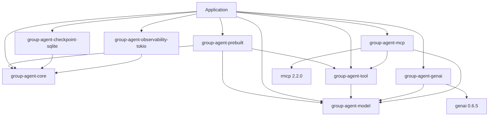
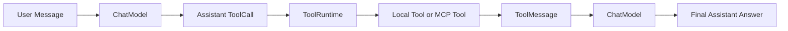

# Group Architecture

This document is the source of truth for Group's current repository
architecture. It describes present contracts, not the order in which they were
implemented. Code and executable tests take precedence if this document drifts.

## Purpose

Group is a strongly typed, asynchronous state-graph runtime for Rust agents. It
provides deterministic graph execution, durable execution ports, provider-
neutral model types, local Tool execution, an experimental prebuilt
Tool-calling Agent, and adapters for SQLite, observability, Genai, and MCP.

Group is a foundation, not a complete Agent product. Its prebuilt loop is
experimental and does not add RAG, embeddings, PDF/OCR ingestion, product
memory extraction, user interfaces, or product authorization and prompt
policy.

## Workspace dependency direction

Normal dependencies are one-way:

- Core does not depend on Model, Tool, Provider SDKs, MCP, SQLx, or adapters.
- Model does not depend on Core, Tool, Provider SDKs, MCP, or a Tokio runtime.
- Tool depends on Model. Core is only a development integration dependency.
- Genai depends on Model and the fixed `genai` adapter dependency.
- MCP depends on Model, Tool, and the fixed `rmcp` client dependency.
- Prebuilt depends on Core, Model, and Tool, and remains provider-neutral.
- SQLite and Tokio observability are external adapters over Core ports.
- The application is the composition root.

Provider, transport, persistence, and UI concerns must not leak downward into
Core or Model public APIs.

## Core Runtime

`group-agent-core` owns graph declaration, compilation, and invocation.

- `GraphState` is `Send + Sync + 'static` and defines one typed `Update`.
- `GraphState` has no `Clone` or Serde requirement.
- A `Node` receives `&State` and `&NodeContext`, then returns an Update.
- Only Runtime calls `apply` or `apply_batch`.
- Compilation validates identifiers, transition shape, target whitelists,
  possible reachability, END reachability, and nested paths.
- `CompiledGraph` is immutable, pre-resolved, reusable, and concurrently
  shareable.
- Conditional routing is synchronous and read-only. Async work belongs in a
  Node and reaches State through an Update.
- Loops are explicit conditional transitions bounded by `max_steps`.
- Shared-state subgraphs use structured `GraphPath` and `NodePath` values.

Parallel super-steps poll Nodes concurrently over one immutable State snapshot.
Runtime waits at a barrier, restores updates to stable compiled-node order,
calls `apply_batch` once, and routes only after a successful commit. It does
not spawn one task per Node.

See [Core Runtime Design](docs/design/core-runtime.md).

## Durable Execution

Durability is opt-in and separate from `GraphState`:

- `CheckpointState` owns snapshot and restore behavior.
- `CheckpointRecord` is the storage-neutral durable domain record.
- `CheckpointCodec` converts typed snapshots and interrupt payloads to bytes.
- `CheckpointStore` persists records and lineage metadata.
- `Checkpointer` adapts the record store to typed Runtime operations.

Content idempotency and lineage compare-and-swap are distinct. An operation ID
replay is checked before expected-parent CAS. State snapshot and codec work run
outside storage locks.

Execution modes have separate contracts:

- Resume continues only the selected latest head.
- Replay reads an exact historical checkpoint and disables all writes.
- Fork is the only operation that creates a writable historical branch.
- Branches enforce thread ownership, membership, independent head CAS, and a
  complete source-to-head parent lineage.
- Interrupt checkpoints retain the interrupted Node and require an explicit,
  single-attempt typed resume value.

The SQLite adapter uses short transactions, exact UUID bytes, sortable
big-endian `u64` values, and embedded migrations.

See [Durable Execution Design](docs/design/durable-execution.md).

## Model and Provider boundary

`group-agent-model` defines provider-neutral messages, Tool data, requests,
responses, capabilities, usage, extensions, errors, and stream events.

Applications call the `ChatModel` facade. The facade validates a `ChatRequest`
and capabilities before constructing the non-bypassable
`ValidatedChatRequest` accepted by raw adapters. The stream collector validates
events atomically, preserves stable ToolCall ordering, merges partial usage,
requires a logical finish, and remains permanently failed after the first
error.

Provider-specific request mapping, response decoding, continuation metadata,
protocol trust, and provider errors remain in adapters. The current Genai
adapter is fixed to `genai` 0.6.5 and deliberately fails closed for unsupported
or untrustworthy streaming paths.

See [Model and Tools Design](docs/design/model-and-tools.md) and
[Genai Adapter](docs/adapters/genai.md).

## Tool Runtime

`group-agent-tool` is the single execution layer for local and remote-backed
Tools:

- immutable registration and one-time JSON Schema compilation;
- argument validation before Tool execution;
- explicit `ReadOnly`, `IdempotentWrite`, and `NonIdempotentWrite` behavior;
- caller-runtime per-call timeout and Future-drop ownership;
- bounded spawn-free batches with stable output order;
- collect-all or stop-scheduling-and-drain fail-fast;
- panic-safe, payload-free observers;
- ToolCall ID-safe ToolMessage helpers.

The Runtime does not provide automatic retry, exactly-once execution, durable
idempotency storage, rollback, or sandboxing.

See [Model and Tools Design](docs/design/model-and-tools.md).

## MCP Adapter

`group-agent-mcp` exposes remote MCP Tools through the existing Tool trait. It
is not a second Registry, timeout, batch, or side-effect runtime.

The current production transport is child-process stdio. Discovery is adapter-
owned and bounded by cursor-cycle, page, and Tool limits. A complete validated
immutable Registry snapshot is published only after all pages succeed. Remote
Tools default to conservative non-idempotent behavior unless the application
supplies an exact validated override.

Explicit Session shutdown owns one shared completion, stops new calls, joins
service close and direct-child cleanup, publishes CLOSED, and then wakes
waiters. Drop is only a best-effort direct-child fallback and does not promise
graceful protocol close, wait/reap under every OS failure, or process-tree
cleanup.

MCP HTTP, OAuth, credential storage, Resources, Prompts, Sampling, Roots,
server hosting, automatic refresh, and retry are not implemented.

See [MCP Adapter](docs/adapters/mcp.md).

## SQLite and Observability adapters

`group-agent-checkpoint-sqlite` implements the durable store without making
Core depend on SQLx. It provides file-restart recovery, transactional
idempotency and CAS, branch metadata, and defensive lineage validation.
Applications still supply the Codec.

`group-agent-observability-tokio` converts synchronous `EventSink` delivery to
a bounded Tokio broadcast channel. It is process-local and lossy. Subscriber
lag is explicit, retention is independent from sink delivery, and no
subscriber failure can fail graph execution.

## Cross-layer control and error ownership

| Layer | Cancellation and timeout ownership | Error boundary |
| --- | --- | --- |
| Core | Run and Node cancellation; run and per-node absolute deadlines; in-flight Node Future drop | Typed build, compile, Node, State, route, checkpoint, and control failures |
| Model / Genai | Caller-owned model Future or stream drop | Validation, capability, protocol, decode, transport, and provider source |
| Tool | Per-call timeout; single and batch Future drop; drain already-started calls during fail-fast | Business `ToolResult` versus typed runtime failure |
| MCP | Local call ownership; independent explicit Session shutdown | Protocol, transport, session, discovery, content, and shutdown failures |
| Prebuilt | Forwarded Core run/Node control; current Model or Tool Future ownership | `AgentError` with immediate `GraphRunError` source and optional current batch report |

No layer performs hidden retry. Dropping a Future releases local ownership but
does not roll back external side effects or prove a remote operation stopped.

Group-owned default Debug, Display, lifecycle events, and Tool observer events
exclude State, updates, prompt text, arguments, output, raw protocol bodies,
environment values, panic payloads, and source messages. Concrete sources are
retained for deliberate diagnostics; applications that traverse or log full
source chains must filter sensitive data. Production logging must also filter
upstream `genai` and `rmcp` targets.

See [Error, Cancellation, and Observability Design](docs/design/error-cancellation-observability.md).

## MSRV layering

| Crate or layer | MSRV |
| --- | --- |
| Core, Model, Tool, Prebuilt, SQLite, Observability | Rust 1.85 |
| Genai adapter | Rust 1.88 |
| MCP adapter | Rust 1.88 |
| Full workspace | Rust 1.88+ |

The adapter MSRV follows syntax required by the fixed upstream releases. A
user that selects only the foundation must not inherit that restriction.

## Stability boundary

The following base contracts have completed the current architecture review
and should evolve compatibly:

- Core State, Node, compiled graph, control, event, and error-source semantics;
- durable Record, Codec, Store, CAS, Resume, Replay, Fork, and branch lineage;
- Model messages, Tool data, requests, responses, validated facade, collector,
  and extensions;
- Tool trait, behavior, Registry, Runtime, report, observer, and message helpers.

`Stable` means compatibility-first additive evolution, not `never changes`.

Genai provider configuration, extension keys, stable-target policy, MCP
transport constructors, MCP discovery configuration, future HTTP/OAuth
surfaces, and the Prebuilt public API remain experimental. Prebuilt's private
State, Update, Nodes, router, topology, and `CompiledGraph` are not public
extension points or permanent compatibility promises. Upstream SDK evolution
may require adapter-level migration without changing the stable base layers.

## Experimental prebuilt Agent and application boundary

`group-agent-prebuilt` composes the existing components into this
non-streaming technical loop:

The experimental `ToolCallingAgent` owns a private constructor-compiled Core
graph, one canonical per-invocation transcript, maximum committed model rounds,
ToolCall dispatch through `ToolRuntime`, and ordinary `FinalAnswer` or
`MaxRounds` outcomes. It forwards Core `RunControl` and `EventConfig`, reuses
Core `EventSink`, continues after business Tool errors, stops on Tool
infrastructure errors, and exposes the complete current failing batch report
when one exists. There is no hidden retry.

Applications create provider adapters, own MCP sessions and Tool registration,
select persistence adapters, and supply product prompts and policy. Local and
MCP-backed Tools enter the Agent through the same ToolRuntime boundary. A
built-in durability codec or resume/replay/fork API, streaming orchestration,
provider construction, MCP lifecycle ownership, retry/fallback, Tool rollback,
exactly-once, approval, structured output, Memory, RAG, PDF/OCR, Multi-Agent,
and middleware are not provided. Repository selection, citation rendering,
product permissions, UI, and prompt policy remain application-owned.

## Further reading

- [Documentation Index](docs/index.md)
- [Quality and Release Status](docs/quality.md)
- [Architecture Decision Records](docs/adr/README.md)
- [Development Runbook](docs/runbooks/development.md)
