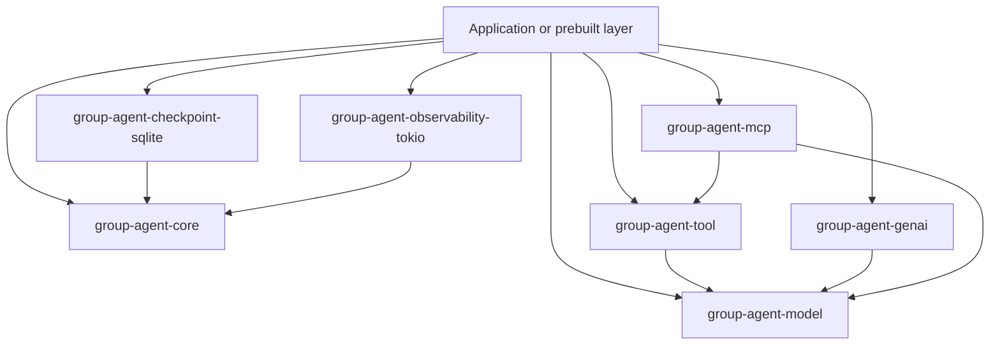

# Group

Group is a strongly typed, asynchronous, durable state-graph runtime for Rust
agents.

It gives applications deterministic graph execution, provider-neutral chat
types, local and MCP-backed Tool execution, and opt-in durability without
coupling the Core runtime to a provider SDK or database.

## Current status

The Runtime, Durable, Model, and Tool base contracts have completed a full
repository architecture review and are intended for compatibility-first
evolution.

Genai and MCP adapter configuration surfaces remain experimental because they
are coupled to fixed upstream releases and evolving protocol behavior.

The repository has the components for a lower-level model/Tool round trip, but
it does **not** yet contain a prebuilt Agent loop. It is not ready for a public
v0.1.0 release; see [Quality and Release Status](docs/quality.md).

## Core capabilities

- strongly typed `GraphState`, Node, and Update boundaries;
- immutable compiled graphs and reusable concurrent invocations;
- fixed, conditional, and fan-out transitions;
- deterministic parallel super-steps and fan-in;
- explicit loops bounded by `max_steps`;
- shared-state nested subgraphs and structured execution paths;
- cooperative cancellation and run/Node deadlines;
- typed lifecycle events and a bounded Tokio broadcast adapter;
- storage-neutral checkpoints and a SQLite reference adapter;
- latest-only Resume, exact read-only Replay, and explicit writable Fork;
- branch ownership, membership, lineage validation, and independent CAS;
- typed interrupt and one-attempt resume values;
- provider-neutral messages, requests, responses, Tool data, and streams;
- validated `ChatModel` facade and atomic stream collector;
- immutable Tool Registry, precompiled JSON Schema, timeout, batching,
  fail-fast drain, observers, and call-ID-safe ToolMessages;
- Genai 0.6.5 adapter with evidence-based fail-closed compatibility;
- MCP 2.2.0 client adapter with bounded discovery and reusable stdio sessions.

## Architecture at a glance



Core does not depend on Model, Tool, Provider, MCP, SQLx, or adapters. The
application is the composition root.

For the complete current contract, read
[ARCHITECTURE.md](ARCHITECTURE.md).

## Quick Start

### Prerequisites

- Rustup with a current stable toolchain.
- Rust 1.88 or newer for the complete workspace.

Clone the repository and run the smallest Core example:

```bash
cargo run -p group-agent-core --example linear
```

The example builds a typed graph:

```text
START -> increment -> END
```

The Node reads immutable State, returns an Update, and Runtime applies the
Update before following the edge.

Run the conditional and parallel examples:

```bash
cargo run -p group-agent-core --example conditional
cargo run -p group-agent-core --example parallel
```

Explore durable modes:

```bash
cargo run -p group-agent-core --example checkpoint
cargo run -p group-agent-core --example resume
cargo run -p group-agent-core --example replay
cargo run -p group-agent-core --example fork
cargo run -p group-agent-core --example interrupt
```

Explore the provider-neutral Model and local Tool Runtime:

```bash
cargo run -p group-agent-model --example model_node
cargo run -p group-agent-tool --example tool_runtime
cargo run -p group-agent-tool --example tool_node
```

The Model example is offline. Tool examples use application-provided local
Tools and do not contact a provider.

The MCP examples use local offline fixtures:

```bash
cargo run -p group-agent-mcp --example mcp_stdio
cargo run -p group-agent-mcp --example mcp_tool_node
```

The Genai mapping example does not require a live API key:

```bash
cargo run -p group-agent-genai --example genai_model
cargo check -p group-agent-genai --example genai_node
```

Applications own credentials, endpoint selection, model mapping, and Client
construction. Group does not read `.env`.

## Runtime model

Every invocation owns its State. A Node receives only `&State` and
`&NodeContext`, then returns a typed Update. Runtime alone mutates State.

Parallel Nodes borrow the same snapshot. Runtime waits at a barrier, restores
Updates to stable compiled order, applies one complete batch, and routes only
after commit.

Group does not require full State Clone, does not put State behind a shared
lock, and does not spawn one task per Node.

See [Core Runtime Design](docs/design/core-runtime.md).

## Durable execution

Checkpointing is opt-in. State snapshotting, durable Record layout, Codec, and
Store are separate capabilities.

- Resume continues a selected latest head.
- Replay re-executes one exact historical checkpoint without writes.
- Fork creates a new writable branch from an exact historical checkpoint.
- Branch lineage is thread-owned, membership-checked, and protected by
  independent CAS.

The SQLite adapter is the reference durable Store. Applications provide the
snapshot and interrupt Codec.

See [Durable Execution Design](docs/design/durable-execution.md).

## Model, Tool, and MCP loop

The current components can be composed as:

```text
User Message
  -> ChatModel
  -> Assistant ToolCall
  -> ToolRuntime
  -> Local Tool or MCP Tool
  -> ToolMessage
  -> ChatModel
  -> Final Assistant Answer
```

The application still owns conversation accumulation, maximum rounds,
ToolCall dispatch, final-answer detection, Agent-facing error policy, and
observability policy.

See:

- [Model and Tools Design](docs/design/model-and-tools.md)
- [Genai Adapter](docs/adapters/genai.md)
- [MCP Adapter](docs/adapters/mcp.md)

## Workspace crates

| Crate | Role | Stability |
| --- | --- | --- |
| `group-agent-core` | graph declaration, compilation, Runtime, events, durable ports | compatibility-first base |
| `group-agent-checkpoint-sqlite` | SQLx SQLite `CheckpointStore` | adapter over stable durable ports |
| `group-agent-observability-tokio` | bounded Tokio broadcast over `EventSink` | adapter over stable event port |
| `group-agent-model` | provider-neutral messages, chat, Tool data, streams, errors | compatibility-first base |
| `group-agent-tool` | Tool Registry, validation, execution, batch, observer | compatibility-first base |
| `group-agent-genai` | `genai` 0.6.5 chat adapter | experimental |
| `group-agent-mcp` | `rmcp` 2.2.0 client Tool backend | experimental |

## Supported boundaries

Group currently supports:

- immutable typed graph execution;
- deterministic parallel Update merge;
- conditional loops and fan-out;
- nested shared-State graphs;
- typed cancellation, timeout, events, and failures;
- in-memory and SQLite-backed checkpoints;
- Resume, Replay, Fork, branches, and interrupts;
- provider-neutral complete and stream calls;
- audited Genai text streaming paths and non-streaming ToolCalls under the
  documented target policy;
- local Tool execution and MCP stdio-backed Tools;
- offline tests and local fixtures.

## Deliberate exclusions

Group does not currently provide:

- a prebuilt Agent;
- RAG, embeddings, vector stores, PDF/OCR, or product memory;
- UI, product authorization, tenancy, or prompt policy;
- provider fallback, load balancing, or hidden retry;
- automatic Tool retry, exactly-once execution, rollback, or sandboxing;
- MCP HTTP, OAuth, credential storage, Resources, Prompts, Sampling, Roots,
  server hosting, or automatic refresh;
- support for every provider streaming path;
- durable event delivery, event history replay, or network event transport;
- PostgreSQL checkpoints, built-in Serde codecs, branch merge, or branch
  deletion.

Unsupported provider or MCP content fails closed rather than being silently
dropped.

## MSRV

Group uses a layered minimum supported Rust version:

| Layer | MSRV |
| --- | --- |
| Core, Model, Tool, SQLite, Observability | Rust 1.85 |
| Genai adapter | Rust 1.88 |
| MCP adapter | Rust 1.88 |
| Complete workspace | Rust 1.88+ |

The higher adapter floor follows syntax required by the fixed upstream
releases. Foundation-only users should not inherit that restriction.

## Documentation

- [Architecture](ARCHITECTURE.md)
- [Documentation Index](docs/index.md)
- [Core Runtime Design](docs/design/core-runtime.md)
- [Durable Execution Design](docs/design/durable-execution.md)
- [Model and Tools Design](docs/design/model-and-tools.md)
- [Error, Cancellation, and Observability](docs/design/error-cancellation-observability.md)
- [Architecture Decision Records](docs/adr/README.md)
- [Execution Plans](docs/exec-plans/README.md)
- [Development Runbook](docs/runbooks/development.md)
- [Independent Review Runbook](docs/runbooks/review.md)
- [Quality and Release Status](docs/quality.md)
- [Stages 01-20 History](docs/history/stages-01-20.md)

## Development and verification

Use the repository verification entrypoint:

```bash
./scripts/verify fast
```

Before independent review:

```bash
./scripts/verify full
./scripts/verify msrv
```

Run the complete matrix with:

```bash
./scripts/verify all
```

The script never contacts a live Model Provider, MCP Server, or external test
service. Its Cargo gates use `Cargo.lock`; when the local registry or cache is
missing, Cargo may download those locked dependencies. Set
`GROUP_VERIFY_OFFLINE=1` to force `CARGO_NET_OFFLINE=true`; missing cached
dependencies then fail without a network fallback. The script fails on the
first error.

Complex work uses a tracked
[Execution Plan](docs/exec-plans/README.md). Implementation and independent
review responsibilities are defined in the
[Development Runbook](docs/runbooks/development.md).

## Security and logging

Group-owned default errors and lifecycle events do not expose State, prompts,
Tool arguments/results, raw protocol payloads, environment values, credentials,
or panic payloads.

Concrete source errors remain available for deliberate diagnostics. An
application that traverses full source chains or enables upstream `genai` or
`rmcp` logging targets must perform its own sensitive-data filtering.

No layer performs hidden retry. Future drop releases local ownership but does
not roll back external side effects.

## License and release status

Workspace manifests declare `MIT OR Apache-2.0`, but checked-in license files
and complete package metadata are not yet present. Internal path dependencies
also require publishable versions and all crates require final `cargo package`
validation before a public release.

The manifest version must not be interpreted as evidence that v0.1.0 has been
published or is ready.

See [Quality and Release Status](docs/quality.md) for the current blockers.
