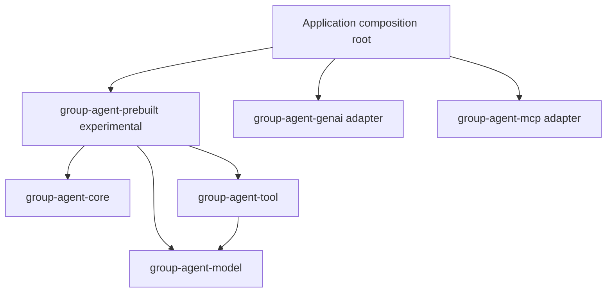
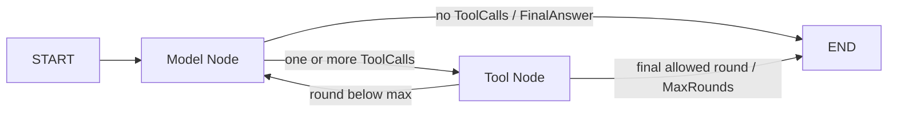

# 021 Stage 21 - Prebuilt Tool-calling Agent

## Status

Completed

- [x] Baseline recorded.
- [x] Design reviewed.
- [x] Slices implemented.
- [x] Verification passed in the current correction environment.
- [x] Independent review completed.
- [x] Review accepted and written back by a write-authorized role.
- [x] Completion evidence recorded.

## Goal

Add an experimental `group-agent-prebuilt` crate that provides a small,
provider-neutral, non-streaming Tool-calling Agent. The Agent must compose the
existing Core graph, Model facade, and Tool runtime into this internal loop:

```text
START -> Model Node -> END
                    -> Tool Node -> Model Node -> ...
```

The measurable result is a high-level invocation API that accepts an existing
`ChatModel`, an existing `ToolRuntime`, and caller-owned conversation messages;
executes zero, one, or multiple model-produced `ToolCall` values; and returns an
ordinary `FinalAnswer` or `MaxRounds` stop reason without introducing provider,
transport, persistence, or product policy into the prebuilt layer.

## Non-goals

- Streaming or `ChatModel::stream` orchestration.
- RAG, embeddings, retrieval, citations, Memory, PDF/OCR ingestion, or prompt
  policy.
- MCP connection, discovery, refresh, authentication, session lifecycle, or
  transport ownership. An application may pass a `ToolRuntime` whose Tools are
  MCP-backed, but the prebuilt crate does not know that.
- Provider client construction, provider selection, credentials, fallback, or
  adapter configuration.
- Multi-Agent orchestration, sub-Agent delegation, middleware, hooks, or a
  second Tool runtime.
- Structured-output parsing or schema-constrained final answers.
- A built-in durable `CheckpointCodec`, Store, database adapter, resume,
  replay, or fork API.
- Retry, automatic fallback, rollback, durable idempotency, sandboxing, or an
  exactly-once claim.
- Tool side-effect rollback when cancellation, timeout, or a later batch item
  fails.
- Changes to the stable Core, Model, or Tool public contracts unless a later
  independently justified correction is explicitly authorized.
- Normal dependencies on `group-agent-genai`, `group-agent-mcp`,
  `group-agent-checkpoint-sqlite`, `group-agent-observability-tokio`, or their
  upstream SDKs.

## Context

Starting baseline on 2026-08-01:

- HEAD: `47b45e391bc7be7eb23e5cf1ed0967d22bdc8b3c`.
- `git status --short`: clean.
- No overlapping active Execution Plan existed; `active/README.md` stated that
  there were no active Plans.
- Protected artifact hashes:
  - `AGENTS.md`:
    `b4325df7f2f681321f66e82cc6b5cff53e05bfa65f6c11bfc57657ecc8c13b0e`
  - `ARCHITECTURE.md`:
    `5baa5c046c32d5782c1f06be7d9a63dd9131469fa802bd338654dd7fb1918e26`
  - `docs/runbooks/development.md`:
    `b6ad72fa73b6996da0c39582e8e28271fe55bc602f1c35628ab645a771d6d9f2`
  - `docs/exec-plans/TEMPLATE.md`:
    `1b60f6d8666078d91387f1a60ed2df259cf6a3dfc61d89d54c3113017241dab0`

Current sources of truth and design constraints:

- [`ARCHITECTURE.md`](../../../ARCHITECTURE.md) keeps Core Model/Tool agnostic,
  places future prebuilt composition above Core, and states that the prebuilt
  loop does not yet exist.
- [`docs/design/core-runtime.md`](../../design/core-runtime.md) defines immutable
  State reads, typed Updates, Runtime-only commit, conditional routing after
  commit, `RunControl`, `max_steps`, and `EventSink`.
- [`docs/design/model-and-tools.md`](../../design/model-and-tools.md) defines the
  validated `ChatModel` facade, provider-neutral Tool messages, bounded
  spawn-free Tool batches, business-result versus infrastructure-error
  semantics, and ToolMessage identity.
- [`docs/design/error-cancellation-observability.md`](../../design/error-cancellation-observability.md)
  defines Future-drop cancellation, deadline precedence, structured source
  chains, payload-safe default formatting, and the Core event port.
- [`docs/quality.md`](../../quality.md) says the stable lower-level contracts
  are ready to compose but no prebuilt Agent loop exists.
- [ADR-001](../../adr/001-core-model-tool-agnostic.md),
  [ADR-005](../../adr/005-validated-model-facade.md),
  [ADR-006](../../adr/006-tool-runtime-policy.md),
  [ADR-007](../../adr/007-mcp-tool-backend.md), and
  [ADR-011](../../adr/011-layered-msrv.md) constrain dependency direction,
  validation, Tool policy, MCP placement, and Rust 1.85 compatibility.

Slice 1 implementation start on 2026-08-01:

- HEAD: `47b45e391bc7be7eb23e5cf1ed0967d22bdc8b3c` (unchanged from the
  planning baseline).
- `git status --short`:
  `?? docs/exec-plans/active/021-prebuilt-tool-calling-agent.md`.
- The only pre-existing worktree item was this untracked active Plan; it is
  the authorized documentation target for Slice 1 and must remain preserved.
- Protected pre-implementation hashes:
  - `Cargo.toml`:
    `e1307c218ac3a583f929a2344a60a4d9e75836807364c3f66b60a6c66ce06d26`
  - `Cargo.lock`:
    `6b477a297eef5572dc54a56d5543a35f9de4655de38cfe6b2d3dc48359033611`
  - this active Plan:
    `7c5b162eddd571fa49d613ff5735bfae5ab3485fb37445aa9f361c9fd78c1a93`

### Public API audit

The planning audit covered current code, examples, and direct tests rather
than relying only on documentation.

| Area | Audited public surface | Finding used by this Plan |
| --- | --- | --- |
| Core State/Node | `GraphState`, `Node`, `NodeContext`, `NodeError`, `StateError` | A private Agent State can own messages and counters; Nodes read `&State`, and only a successfully returned typed Update can commit changes. A failed model call therefore cannot increment a State counter. Model and Tool failures can be wrapped with `NodeError::with_source`. |
| Core graph | `StateGraph`, `CompiledGraph`, `RunReport`, conditional routing | A reusable internal compiled graph can express the complete loop. Routing observes committed State, and a failed Node produces no Update to commit. |
| Core control/events | `RunConfig`, `RunControl`, `EventConfig`, `EventSink`, `GraphEvent` | High-level invocation can forward cancellation, run/node timeout, and the existing event sink. It does not need a new observability protocol. |
| Core errors | `GraphBuildError`, `GraphCompileError`, `GraphRunError` | `GraphRunError` already distinguishes cancellation, run timeout, node timeout, maximum steps, Node failure, State failure, and route failure while retaining Node sources. |
| Model facade | `ChatModel`, `ChatModelAdapter`, `ChatRequest`, `ChatResponse` | Version one must call only `ChatModel::complete`; facade validation and capability checks remain non-bypassable. Dropping the Node Future drops the model Future. |
| Model messages | `Message`, `AssistantMessage`, `ToolCall`, `ToolMessage` | The ordered message history is the canonical conversation state. The next Tool batch is derived from the last assistant message instead of being duplicated in a pending-call field. |
| Model usage | `TokenUsage` | Usage is per response and may be absent or partial. It must be retained per model round; `merge_snapshot` must not be misused to aggregate independent rounds. |
| Tool definitions | `ToolRuntime::registry`, `ToolRegistry::definitions`, `ToolDefinition` | The current API is sufficient: the immutable Registry exposes definitions in stable lexical name order. Each owned `ChatRequest` can collect `definitions().cloned()` without changing Tool. |
| Tool execution | `execute_batch`, `ToolBatchConfig`, `ToolBatchReport`, `ToolExecutionReport` | Default bounded collect-all is already spawn-free and reports results in input order. Primary infrastructure failures remain errors; terminal observer failures remain secondary diagnostics. |
| Tool messages/errors | `execute_message`, `into_tool_messages`, `ToolRuntimeError`, `ToolBatchError` | Existing helpers preserve original `ToolCallId`. Business errors are successful infrastructure outcomes with `is_error = true`; runtime and batch failures must not become fake messages. |

Slice 1 revalidated these signatures at implementation-start HEAD
`47b45e391bc7be7eb23e5cf1ed0967d22bdc8b3c`. No audited Core, Model, or Tool
public signature had drifted from the planning audit, and Slice 1 changes none
of those crates or their public APIs.

The more detailed Tool diagnostics audit found one composition-layer gap:

- `ToolBatchError` is only a pre-execution batch-configuration/identity error
  (`ZeroConcurrency` or duplicate call ID). It does not represent per-call
  collect-all outcomes and needs no source because its present variants have
  no lower-level error.
- `ToolBatchReport::results()` and `into_results()` retain every primary
  outcome in original input order. Each position is either a successful
  `ToolResult` (whose `is_error` flag distinguishes ordinary success from a
  business error) or a `ToolRuntimeError` (an infrastructure failure).
- `ToolBatchReport::terminal_observer_failures()` retains the secondary
  observer diagnostic aligned to the same input position, while
  `into_tool_messages()` pairs every successful/business-error result with its
  original `ToolCallId` and leaves infrastructure failures as errors.
- `ToolExecutionReport` provides the same primary-versus-secondary separation
  for one call through `primary()`, `terminal_observer_failure()`, and
  `into_parts()`.
- `ToolRuntimeError` exposes stable kind, safe call identity, Tool name, batch
  index, redacted schema location, and timeout. Its `Error::source()` retains
  the concrete `ToolError`, schema-validation error, observer failure, or
  adapter source where one exists.
- Default `Debug`/`Display` for these types is payload-safe: `ToolResult`
  reports counts and byte lengths, `ToolRuntimeError` reports classification
  and safe identity rather than source messages, observer errors discard or
  redact callback/panic details, and message/argument/result bodies are not
  formatted. Deliberate source traversal can expose upstream details and
  remains application-filtered.

The existing types therefore preserve complete collect-all execution facts
and order while the report is available. They cannot, by themselves, preserve
that complete report as the source of a Core `NodeError`: `ToolBatchReport`
does not implement `Error`, while choosing one `ToolRuntimeError` as the Node
source would discard the other successes and failures. A later Tool Node thus
needs a small experimental Agent-owned aggregate error/report wrapper. Its
exact name and API remain unfrozen; it must own the original ordered report,
make every result inspectable, and retain a concrete infrastructure source
chain without changing Tool. Slice 1 deliberately does not implement or
publicly declare that type.

The ChatRequest audit also fixes a provider-neutral request policy for every
model round:

- Empty immutable Registry: advertise an explicit empty `Vec<ToolDefinition>`
  and set `ToolChoice::None` explicitly.
- Non-empty immutable Registry: clone the Registry's complete stable lexical
  `ToolDefinition` sequence and set `ToolChoice::Auto` explicitly.
- Definitions and choice are constructed together from the same Registry
  snapshot. Version one never uses `Required` or `Named` on its own.
- The implementation must call `with_tools(...)` and `with_tool_choice(...)`
  even though `ChatRequest::new` currently defaults to `Auto`; it must not
  depend on that constructor default or any provider default.
- Routing and final-answer detection use only the returned
  `AssistantMessage::tool_calls()`. Provider finish reason is neither required
  nor authoritative.

Slice 1 dependency conclusion: `group-agent-prebuilt` has exactly three direct
normal dependencies: `group-agent-core`, `group-agent-model`, and
`group-agent-tool`. No direct common library is yet justified, so Slice 1 adds
neither `async-trait` nor `thiserror`. The complete normal transitive tree is
the union of those three existing foundation trees (Tool already reuses
Model); it contains no `group-agent-genai`, `group-agent-mcp`,
`group-agent-checkpoint-sqlite`, `group-agent-observability-tokio`, `genai`,
`rmcp`, or `sqlx`. Cargo metadata confirms edition 2024, Rust 1.85, one library
target, and no feature-expanded dependency path.

Direct composition evidence audited:

- [`crates/group-agent-model/examples/model_node.rs`](../../../crates/group-agent-model/examples/model_node.rs)
  and [`crates/group-agent-genai/examples/genai_node.rs`](../../../crates/group-agent-genai/examples/genai_node.rs)
  show `ChatModel::complete` inside an ordinary Group Node and propagation of
  Core cancellation/timeout through Future drop.
- [`crates/group-agent-tool/examples/tool_node.rs`](../../../crates/group-agent-tool/examples/tool_node.rs)
  shows local `ToolRuntime` execution and correctly paired Tool messages inside
  a Group Node.
- [`crates/group-agent-mcp/examples/mcp_tool_node.rs`](../../../crates/group-agent-mcp/examples/mcp_tool_node.rs)
  shows that an MCP-backed Registry is still consumed through `ToolRuntime`;
  Stage 21 must not add an MCP dependency.
- [`crates/group-agent-model/tests/model_integration.rs`](../../../crates/group-agent-model/tests/model_integration.rs),
  [`crates/group-agent-tool/tests/tool_runtime.rs`](../../../crates/group-agent-tool/tests/tool_runtime.rs),
  and [`crates/group-agent-mcp/tests/group_integration.rs`](../../../crates/group-agent-mcp/tests/group_integration.rs)
  directly verify facade validation, request isolation, Tool batching and
  message identity, cancellation/timeout Future drop, and concrete source
  chains through `GraphRunError`.

## Roles and permissions

- **User / Product Owner:** defines goals and product trade-offs, authorizes
  material changes such as public API, persistence format, or high-risk
  dependencies, and owns final acceptance without prescribing every
  implementation detail.
- **Mentor / Orchestrator:** checks technical direction, task and review
  boundaries, and correction needs; prepares or reviews Codex instructions
  without replacing the User's product decisions.
- **Codex A / Implementer:** modifies only authorized scope, updates this Plan,
  Decision log, and Completion evidence, runs verification and self-review,
  and escalates unauthorized high-risk expansion.
- **Codex B / Independent Reviewer:** remains strictly read-only by default,
  independently inspects actual evidence, and emits a standalone conclusion
  without modifying source, documentation, or this Plan.

## Invariants

- `group-agent-prebuilt` is a composition layer. Core remains independent of
  Model, Tool, provider SDKs, MCP, SQLx, and adapters.
- Normal dependencies are limited to `group-agent-core`, `group-agent-model`,
  `group-agent-tool`, and the minimum necessary general-purpose libraries.
  Expected general-purpose needs are `async-trait` and `thiserror`; additions
  require evidence and review.
- The new crate has Rust 2024 edition, declares Rust 1.85 through workspace
  metadata, inherits workspace lints, and contains no unsafe code.
- The Agent uses an internal Core graph with one Model Node and one Tool Node.
  It does not hand-write a second execution scheduler.
- Version one invokes only non-streaming `ChatModel::complete`.
- The message history is ordered and canonical. Assistant ToolCalls and paired
  ToolMessages are appended exactly once in model/input order.
- Zero ToolCalls is a final answer. One or more ToolCalls route to the Tool
  Node. Routing uses the actual `AssistantMessage::tool_calls` collection, not
  a provider-specific finish-reason convention.
- Tool definitions come from the same immutable Registry used for execution.
  A `ChatRequest` sees a stable lexical snapshot and cannot advertise a Tool
  that was not in that Registry snapshot.
- Tool execution uses `ToolBatchConfig::default()` exactly. Version one exposes
  no Tool concurrency or failure-policy configuration; a future additive
  `AgentToolPolicy` may introduce reviewed Tool policy without changing
  `AgentConfig` version-one semantics.
- A `ToolResult` with `is_error = true` becomes a real paired `ToolMessage` and
  the Agent may continue.
- `ToolBatchError` or any primary per-call `ToolRuntimeError` stops the Agent.
  No infrastructure failure is converted to a ToolMessage.
- A terminal `ToolObserverFailure` remains secondary to the primary execution
  result, as required by ToolRuntime. It does not turn a completed Tool call
  into an Agent failure or a different business result.
- A Tool batch either returns one Tool Update containing all paired messages,
  or returns an error and commits no Tool messages to Agent State. This is
  atomic State commit only: already executed Tool side effects are neither
  rolled back nor claimed not to have occurred.
- `model_rounds` counts only model calls that return successfully and whose
  AssistantMessage is committed to State. `max_rounds` limits those successful
  committed model rounds. A model failure returns `AgentError` immediately and
  records no failed attempt in State.
- The final allowed model round may still request Tools. Those ToolCalls run
  to the complete collect-all report; if they have no infrastructure failure,
  the Agent stops with `MaxRounds` after committing their ToolMessages and does
  not make another model call. This is an explicit product policy with a real
  cost: Tools may produce external side effects, while the model receives no
  later round in which to read those ToolMessages or produce a final answer;
  the outcome's `final_message()` is therefore `None`.
- `FinalAnswer` and `MaxRounds` are normal `AgentStopReason` values, not errors.
- No layer retries implicitly. Scripted failure tests must observe exactly one
  model or Tool attempt unless the graph explicitly reaches another round.
- Core cancellation and timeout controls remain authoritative. Future drop
  cannot prove remote cancellation and cannot undo external side effects.
- Default Debug, Display, events, examples, and tests do not expose prompts,
  message bodies, Tool arguments/results, State, credentials, raw provider/MCP
  payloads, environment values, panic payloads, or concrete source messages.
- The first version does not implement durability. No checkpoint format,
  Codec identity, Store behavior, migration, or lineage contract changes.

## Proposed design

### Dependency and ownership shape



`group-agent-prebuilt` does not depend on Genai or MCP. An application creates
provider adapters and any local or MCP-backed `ToolRuntime`, then passes only
the stable Model and Tool abstractions into the Agent constructor.

### Experimental public API

The initial public surface is deliberately high-level and documented as
experimental before v0.1.0:

- `ToolCallingAgent`: immutable, reusable owner of the internal
  `CompiledGraph`; constructed from `ChatModel`, `ToolRuntime`, and
  `AgentConfig`.
- `AgentConfig`: only a positive `max_rounds`, with a conservative default.
  `AgentConfig::new` returns `Result<AgentConfig, AgentConfigError>`; invalid
  zero values and checked overflow while deriving Core limits are typed
  construction errors. Tool batching is fixed to `ToolBatchConfig::default()`
  in version one.
- `AgentConfigError`: experimental, source-free `ZeroMaxRounds` and
  `MaxStepsOverflow` construction classifications with payload-safe default
  formatting.
- `AgentOutcome`: owns the final ordered `Vec<Message>`, per-round
  `Vec<Option<TokenUsage>>`, completed model-round count, and
  `AgentStopReason`.
- `AgentStopReason`: non-exhaustive `FinalAnswer` and `MaxRounds` variants.
- `AgentBuildError`: typed graph-build and graph-compile failures. Invalid
  configuration is rejected earlier by `AgentConfigError`.
- `AgentError`: source-preserving invocation failure whose immediate source is
  the concrete `GraphRunError`; its experimental `tool_batch_report()`
  accessor borrows a complete ordered report only when the private source
  chain contains an aggregate Tool batch infrastructure failure.

Exact names remain subject to implementation review, but the semantic surface
above is the authorized boundary. Public types and modules must carry an
explicit experimental stability notice. The internal Agent State, Update,
Model Node, Tool Node, and routers stay crate-private; they are implementation
details and are not made public merely to expose the Core composition. Slice 1
must first determine whether existing `ToolBatchReport`, `ToolBatchError`, and
`ToolRuntimeError` types preserve the required ordered failures and concrete
source chains. Only if they are insufficient may implementation propose an
experimental `AgentToolBatchError`; this Plan does not pre-authorize that type
as inevitable. If State or Update ever needs to become public, that is a
separate compatibility decision and it starts experimental.

The high-level methods should be no broader than:

```text
ToolCallingAgent::new(model, tools, config) -> Result<Self, AgentBuildError>
ToolCallingAgent::invoke(messages) -> Result<AgentOutcome, AgentError>
ToolCallingAgent::invoke_with_control(messages, event_config, run_control)
    -> Result<AgentOutcome, AgentError>
```

Slice 2 implements only `new` and `invoke`. `invoke_with_control` remains
unimplemented until the later cancellation/error slice; `invoke` currently
uses the private compiled graph's ordinary default-control Core path.

The public API does not expose the internal `CompiledGraph`. Exposing it would
leak private State/Update types, make graph topology a compatibility promise,
and invite callers to bypass round and stop semantics. Advanced users already
have Core and can build their own graph.

### Agent State and Updates

The minimal private State contains:

1. `messages: Vec<Message>` as the single canonical transcript;
2. `model_rounds: usize` for successfully committed model calls;
3. `usage_by_round: Vec<Option<TokenUsage>>`, aligned one-to-one with committed
   model rounds so absent usage remains distinguishable from zero usage; and
4. `stop_reason: Option<AgentStopReason>` while the graph is still running.

There is no duplicated `pending_tool_calls` field. The Tool Node reads the last
assistant message after the Model Update commits. There is no cloned
`final_message` field in State either. `AgentOutcome::final_message()` derives
an `Option<&AssistantMessage>` from the stop reason and last transcript entry.

The private Update is a small enum:

- a Model update appends exactly one assistant message, increments
  `model_rounds`, appends that response's optional `TokenUsage`, and sets
  `FinalAnswer` only when the assistant produced no ToolCalls;
- a Tool update appends the complete ordered set of paired ToolMessages and
  sets `MaxRounds` only when those messages belong to the final allowed model
  round.

`final_message` must be optional because `MaxRounds` can occur after the final
allowed assistant turn requested Tools: those Tools are fully executed and the
transcript then ends in ToolMessages without a subsequent assistant answer. A
normal `MaxRounds` outcome therefore cannot promise an assistant final message.

The Model Node constructs each owned request from a clone of the canonical
messages plus
`tool_runtime.registry().definitions().cloned().collect::<Vec<_>>()`. It pairs
that definition vector with explicit `ToolChoice::None` when the Registry is
empty or explicit `ToolChoice::Auto` otherwise. The Registry is immutable and
cheaply shared; no new Tool definition snapshot API is required. The request
clone is transient ownership required by `ChatModel::complete`, not a second
persistent Agent state.

`ChatResponse::message` supplies the canonical assistant turn. Version one
retains optional `TokenUsage` per round but does not invent cross-round token
aggregation: `TokenUsage::merge_snapshot` is for cumulative snapshots of one
response, not addition across independent model calls. Other response-level
identity and provider metadata are not routing state; preserving more of them
would require a separately reviewed additive outcome type rather than storing
a duplicate `ChatResponse` beside its assistant message.

### Graph routing and limits



`max_rounds` and Core `max_steps` are different controls:

- `max_rounds` is Agent semantics and limits only successfully returned model
  calls whose AssistantMessages commit to State;
- `max_steps` is a Core safety bound and counts every executed Node, including
  Tool Nodes.

For positive `max_rounds = R`, the internal graph needs at most `2 * R` Core
steps: one Model and at most one Tool Node for each round. The constructor uses
checked multiplication and invokes Core with the derived private
`RunConfig::new(2 * R)`. The Core limit is a defensive topology ceiling, not a
second user-visible round policy. A one-round final answer takes one step; a
one-round Tool request takes two steps, commits the Tool messages, and returns
`MaxRounds`.

The last-round Tool behavior is a deliberate product choice, not the only
possible semantics. It preserves execution and ToolMessage pairing for calls
the accepted assistant turn requested, but Tools may cause real external side
effects and the model is not called again to inspect their messages or compose
a final answer. Accordingly, a Tool-ending `MaxRounds` outcome has
`final_message() == None`. Changing this trade-off later requires an explicit
product decision and compatibility review.

### Tool batch commit and failure semantics

The Tool Node clones the last assistant turn's ToolCalls into input order and
calls ToolRuntime's bounded collect-all batch. It waits for the complete report
before constructing an Update.

- Every primary result is successful, including business-error ToolResults:
  pair all results with the original call IDs, preserve input order, and return
  one Tool Update.
- A batch-level `ToolBatchError` occurs: return a source-preserving Node error;
  do not return an Update.
- One or more per-call primary `ToolRuntimeError` values occur: preserve the
  complete report's failures in input order and a concrete source chain using
  existing public Tool types if they are sufficient; do not return an Update
  or fabricate messages for any failed call. Only the Slice 1 audit may justify
  proposing an experimental Agent-owned batch error when the existing types
  cannot express both requirements.
- Terminal observer diagnostics do not replace primary outcomes. The caller's
  configured Tool observer already owns its diagnostic policy; version one
  does not duplicate those diagnostics into Agent State or a new event stream.

Consequently, if calls A and B succeed but C has an infrastructure failure,
the external effects of A or B may already exist, yet no ToolMessages from
that batch are committed to Agent State. This is the only behavior consistent
with immutable Node reads, one typed Update, Runtime-only commit, and the
explicit absence of rollback or exactly-once guarantees.

### Errors, cancellation, timeout, and events

`AgentError` wraps `GraphRunError` with `#[source]`; it does not flatten Core
classification into strings. Model Node failure uses
`NodeError::with_source(..., ModelError)`. Tool Node failure preserves
`ToolBatchError` directly when no report exists. When a complete report
contains primary infrastructure failures, private `AgentToolBatchFailure`
owns it and exposes the first input-order `ToolRuntimeError` as its generic
source. `AgentError::tool_batch_report()` borrows the complete ordered report
without exposing the private wrapper. Required chains therefore remain
reachable:

```text
AgentError
  -> GraphRunError::NodeFailed
  -> NodeError
  -> ModelError

AgentError
  -> GraphRunError::NodeFailed
  -> NodeError
  -> private AgentToolBatchFailure
  -> ToolRuntimeError
  -> ToolError / adapter source
```

Core cancellation, run timeout, and node timeout remain concrete
`GraphRunError` variants under `AgentError`. The Agent forwards `RunControl`
unchanged, creates no detached task, and adds no retry. Dropping the Agent
invocation drops the graph, model, and Tool futures currently owned below it.

The first version reuses `EventConfig` and Core `EventSink` through
`CompiledGraph::invoke_with_control`. Observers see the existing graph and Node
lifecycle metadata for the internal `model` and `tools` Nodes. The crate does
not define parallel Agent lifecycle events and does not add a normal dependency
on the Tokio observability adapter. ToolRuntime's existing `ToolEventSink`
continues to report Tool-call lifecycle independently at its existing boundary.

### Additive future evolution

- Durability can be added later through a separately reviewed Agent state
  snapshot/restore contract, optional Codec, and high-level durable invocation
  methods. The private v1 State is not declared serializable, and no codec
  identity or checkpoint format is reserved prematurely. Basic non-durable
  `invoke` and `AgentOutcome` semantics remain unchanged.
- Streaming can be added through a separate method and streaming Model Node
  that uses the existing Model stream contract. Partial deltas must not be
  committed as completed assistant/tool turns. The v1 `complete` method,
  stop-reason rules, and non-streaming outcome remain available unchanged.
- Optional response-metadata or terminal-observer diagnostic reporting can be
  added as new outcome fields or accessors without changing routing, message
  pairing, or error classification.
- Tool concurrency, per-call options, or a non-default failure policy can be
  added later through an additive, separately reviewed `AgentToolPolicy`.
  Version-one `AgentConfig` remains a `max_rounds`-only contract.

## Implementation slices

### Slice 1: API and dependency audit

- [x] Revalidate the audited Core, Model, and Tool signatures against the
  implementation-start HEAD and record any drift in this Plan.
- [x] Confirm `ToolRuntime::registry().definitions()` supplies the exact
  immutable definition set needed by every `ChatRequest`; do not change Tool
  merely to add another snapshot API.
- [x] Audit `ToolBatchReport`, `ToolBatchError`, and `ToolRuntimeError` for
  ownership, ordered multi-failure inspection, and concrete source-chain
  preservation. Prefer those existing public types. Propose an experimental
  `AgentToolBatchError` only if evidence shows they cannot retain both the full
  ordered failure set and required sources; record that decision before
  implementation.
- [x] Add the workspace member and minimal Rust 1.85 manifest for
  `group-agent-prebuilt`; verify the normal dependency tree contains only
  Core, Model, Tool, and justified common libraries.
- [x] Add compile-time/public-surface tests or doctests showing the intended
  experimental API without exposing private State, Update, Nodes, routers, or
  `CompiledGraph`.
- [x] Slice verification and dependency/MSRV self-review.

### Slice 2: Minimal model-only graph

- [x] Implement the private State/Update, Model Node, model-only transition,
  graph construction, high-level Agent constructor, and model-only invocation.
- [x] Build `ChatRequest` from the canonical messages and current immutable
  Registry definitions; call only `ChatModel::complete`.
- [x] Return `FinalAnswer`, optional final-message access, aligned per-round
  usage, and the complete transcript without duplicate persistent message or
  pending-call state.
- [x] Add direct public-boundary tests for empty Registry, exact request shape,
  zero ToolCalls, optional usage, and response finalization.
- [x] Slice verification and diff/self-review.

### Slice 3: Tool Node and message pairing

- [x] Implement one Tool Node that derives calls from the committed last
  assistant message and uses bounded collect-all.
- [x] Route zero ToolCalls directly to `END`; pair one or multiple results with
  original `ToolCallId` values and append messages in model input order.
- [x] Continue after business-error ToolResults; stop on batch or primary
  infrastructure errors without a fake ToolMessage.
- [x] Use `ToolBatchConfig::default()` without exposing Tool concurrency or
  failure-policy fields through `AgentConfig`.
- [x] Preserve all-or-no-Tool-Update State commit while explicitly documenting
  that external side effects do not roll back.
- [x] Respect ToolRuntime terminal-observer secondary-diagnostic semantics.
- [x] Add direct tests at `ToolCallingAgent::invoke`, plus narrow private State
  tests for the atomic apply invariant.
- [x] Slice verification and concurrency/performance-structure self-review.

### Slice 4: Multiple rounds and round limit

- [x] Implement Tool-to-Model looping and increment `model_rounds` only when a
  model call succeeds and its AssistantMessage commits to State; a failed call
  returns `AgentError` without a State round entry.
- [x] Validate positive `max_rounds`, derive checked `2 * max_rounds` Core
  `max_steps`, and keep the two concepts distinct in API and documentation.
- [x] Execute all ToolCalls emitted by the final allowed model round, then
  return normal `MaxRounds` without another model call; document and test that
  Tools may have external side effects while the model never reads the final
  ToolMessages or generates a final answer.
- [x] Ensure `AgentOutcome::final_message()` is `None` for the ordinary
  Tool-ending `MaxRounds` path and `Some` for `FinalAnswer`.
- [x] Add exact successful-round, model/Tool call-count, transcript-order, and
  `final_message() == None` tests.
- [x] Slice verification and loop-bound self-review.

### Slice 5: Errors, cancellation, and source chains

- [x] Implement typed construction and invocation errors with payload-safe
  default formatting.
- [x] Keep `GraphRunError` as the immediate `AgentError` source and retain
  concrete `ModelError`, `ToolBatchError`, `ToolRuntimeError`, `ToolError`, and
  adapter sources below `NodeError` where applicable.
- [x] Forward `RunControl` and `EventConfig`; verify model and Tool Future drop
  on cancellation, run timeout, and node timeout without detached work.
- [x] Verify default events and errors contain no messages, arguments, results,
  State, panic payload, or concrete source text.
- [x] Add no-retry tests with exact adapter/Tool invocation counts.
- [x] Slice verification and failure/security self-review.

### Slice 6: Examples, tests, benchmark, and documentation

- [x] Add an entirely offline prebuilt Tool-calling example using a scripted
  model and local Tools; it must demonstrate a Tool round and final answer
  without credentials or network access.
- [x] Add crate doctests for construction, model-only completion, normal stop
  reasons, and source traversal.
- [x] Add a Criterion benchmark for offline model-only and one-Tool-round
  orchestration. Treat `--no-run` as compilation evidence only; make no runtime
  performance claim without measured runs and environment details.
- [x] Update `README.md`, `ARCHITECTURE.md`, `docs/index.md`, the relevant design
  documents, `docs/quality.md`, and `scripts/verify` only as required to make
  the implemented crate, experimental stability, doctest, and Rust 1.85 gates
  authoritative. Do not add product RAG/Memory/UI guidance.
- [x] Run targeted and unified verification; record every actual outcome and
  skipped check in this Plan.
- [x] Self-review final API, dependency tree, deterministic ordering, round and
  step bounds, cancellation, error redaction, compatibility, and benchmark
  relevance.

### Slice 7: Independent review

- [x] Hand the accepted implementation scope, full diff, dependency evidence,
  commands, skips, and this Plan to an independent read-only Codex B.
- [x] Codex B independently reads manifests, source, public docs, examples,
  tests, benchmarks, relevant dependency sources, and the worktree diff; it
  reruns proportionate gates and emits a standalone review report.
- [x] The User / Product Owner and Mentor / Orchestrator accept or reject the
  review disposition.
- [x] A write-authorized role applies required corrections, reruns affected
  gates, and records accepted findings and completion evidence here.
- [x] Keep the Plan active until accepted review, corrections, verification,
  and writeback are complete.

## Acceptance criteria

The following are direct behavior-test categories at the public Agent boundary.
Each numbered category requires at least one focused test; helper-only tests do
not satisfy it.

1. [x] **Model-only final answer:** with zero registered Tools and a response
   containing zero ToolCalls, exactly one `complete` call occurs, the transcript
   appends one assistant turn, stop reason is `FinalAnswer`, and
   `final_message()` is `Some`; the request advertises an explicit empty Tool
   definition vector with explicit `ToolChoice::None`.
2. [x] **Single ToolCall loop:** one assistant ToolCall executes once, produces
   a ToolMessage with the exact original call ID, and the next model request
   contains user, assistant, and Tool messages in order before a final answer.
3. [x] **Multiple ToolCalls:** multiple calls use
   `ToolBatchConfig::default()`, obey ToolRuntime's existing side-effect and
   bounded-concurrency policy, and commit paired ToolMessages in model input
   order even when completion order differs; no Agent concurrency field exists.
4. [x] **Business error continuation:** a ToolResult with `is_error = true`
   becomes a paired ToolMessage and the model receives it on the next round;
   it is not an `AgentError`.
5. [x] **Infrastructure failure commit:** any primary per-call
   `ToolRuntimeError` or `ToolBatchError` stops the Agent, creates no fake
   ToolMessage, and returns no partial Tool Update even when other calls
   completed; the test does not claim their external effects rolled back.
6. [x] **Round accounting:** only successfully returned model calls whose
   AssistantMessages commit to State increment `model_rounds`; `max_rounds`
   limits that committed count; a failed model call returns `AgentError`
   without a failed-attempt State entry; and scripted call counters show no
   hidden retry.
7. [x] **Final-round ToolCalls:** ToolCalls from model round `max_rounds` execute
   completely; successful/business-error results are committed; no additional
   model call occurs to read those ToolMessages or generate a final answer;
   stop reason is `MaxRounds`; `final_message()` is `None`; and the test records
   that successfully invoked Tools may already have produced external side
   effects.
8. [x] **Round versus step bounds:** zero/overflowing configuration fails
   before execution, while valid `R` permits up to `2 * R` internal Node steps
   and does not misreport Core `MaxStepsExceeded` as ordinary `MaxRounds`.
9. [x] **Cancellation:** deterministic marker/`Notify` tests cancel pending
   model and pending Tool paths through `RunControl`, observe Future drop, and
   retain `AgentError -> GraphRunError::Cancelled` without retry.
10. [x] **Timeout:** paused-time or deterministic deadline tests cover pending
    model and Tool paths, distinguish run timeout from node timeout, observe
    Future drop, and retain the concrete `GraphRunError` timeout variant.
11. [x] **Model source chain and redaction:** a concrete provider/source error
    is reachable through `AgentError -> GraphRunError -> NodeError ->
    ModelError -> source`, while default Debug/Display/events exclude secret
    prompt, provider payload, and source text.
12. [x] **Tool source chain and redaction:** concrete Tool and adapter sources
    are reachable through `AgentError -> GraphRunError -> NodeError -> existing
    Tool error representation -> ToolRuntimeError -> source`; the full ordered
    failure collection is inspectable through existing public Tool types or a
    Slice-1-justified experimental Agent type, and default formatting excludes
    arguments, results, and source messages.
13. [x] **Invalid initial transcript:** an invalid caller-supplied transcript
    fails before raw model dispatch, performs zero adapter calls, and preserves
    `AgentError -> GraphRunError::NodeFailed -> NodeError -> ModelError ->
    RequestValidationError` without string flattening.
14. [x] **Unknown ToolName:** when the model returns a ToolCall whose name is
    absent from the immutable Registry, ToolRuntime lookup fails, the Agent
    stops, no fake ToolMessage is appended, the model is not called again, and
    exact counters prove no hidden retry.

Additional required direct coverage:

- [x] Public API/compile coverage proves version-one `AgentConfig` exposes only
  `max_rounds`; Tool concurrency and failure policy remain fixed behind
  `ToolBatchConfig::default()`.
- [x] Public configuration tests prove zero is rejected as
  `AgentConfigError::ZeroMaxRounds`, the first overflowing `2 * max_rounds`
  value is rejected as `MaxStepsOverflow`, positive values are preserved, and
  the default remains valid at 8.
- [x] The exact stable ToolDefinition snapshot advertised to every model round
  matches the immutable execution Registry. Empty means explicit empty
  definitions plus `ToolChoice::None`; non-empty means all definitions in
  stable lexical order plus `ToolChoice::Auto`. Neither path relies on
  `ChatRequest` or Provider defaults.
- [x] A terminal Tool observer failure does not replace a successful, business-
  error, infrastructure-error, or timeout primary result.
- [x] Core `EventSink` receives one coherent graph lifecycle with model/tool
  Node metadata and no State or payload; no duplicate Agent event stream exists.
- [x] Optional `TokenUsage` entries remain aligned per model round and are not
  incorrectly merged as cumulative snapshots across calls.
- [x] ToolCalls are authoritative for routing when provider finish-reason data
  is unusual; no provider-specific convention enters the prebuilt crate.
- [x] Concurrent invocations on one immutable Agent remain isolated and do not
  share conversation State, round counters, cancellation tokens, or outcomes.
- [x] Consecutive Slice 2 invocations on one immutable Agent use fresh State,
  preserve distinct transcripts and usage, and reuse the one constructor-built
  `CompiledGraph` without recompilation.
- [x] Dropping the top-level Agent future drops current model/Tool work and
  creates no detached task.
- [x] Cancellation, timeout, and failure paths use exact adapter/Tool counters
  to prove one dispatch or execution attempt and no hidden retry or fallback.
- [x] The offline example, doctests, and benchmark target compile on the
  intended targets and contact no live Provider, MCP Server, or external
  service.
- [x] Normal dependency-tree evidence contains Core, Model, Tool, and only
  justified general libraries; it contains no Genai, MCP, SQLite,
  Observability adapter, provider SDK, `rmcp`, `sqlx`, or hidden retry runtime.
- [x] The crate and all of its current targets pass the Rust 1.85 foundation
  gates required by Slice 1.
- [x] Authoritative docs describe the implemented experimental capability and
  continue to place provider, MCP lifecycle, persistence, RAG, Memory, UI, and
  prompt policy outside it.
- [x] The current Stage 21 changed-file scope matches the accepted Plan,
  unrelated user changes are preserved, and no Git commit is created without
  explicit authorization.

## Verification

The Implementer records exact commands and outcomes while working. Required
unified gates before independent review:

```text
./scripts/verify fast
./scripts/verify full
./scripts/verify msrv
```

Task-specific gates:

```text
cargo test --locked -p group-agent-prebuilt
cargo test --locked -p group-agent-prebuilt --all-targets
cargo test --locked -p group-agent-prebuilt --doc
cargo test --locked -p group-agent-prebuilt --examples
cargo bench --locked -p group-agent-prebuilt --no-run
cargo check --locked -p group-agent-prebuilt --all-targets --all-features
cargo clippy --locked -p group-agent-prebuilt --all-targets --all-features -- -D warnings
cargo +1.85.0 check --locked -p group-agent-prebuilt --all-targets --all-features
cargo +1.85.0 test --locked -p group-agent-prebuilt --all-targets
cargo +1.85.0 test --locked -p group-agent-prebuilt --doc
cargo tree --locked -p group-agent-prebuilt --edges normal
cargo tree --locked -p group-agent-prebuilt --depth 1 --edges normal
cargo metadata --locked --no-deps --format-version 1
git diff --check
git status --short
```

Also inspect the full normal tree and metadata to prove the forbidden adapters
and SDKs are absent rather than treating a direct-only tree as sufficient.
Run the offline example explicitly if `cargo test --examples` does not execute
its path. Actual `cargo bench` is required only for a performance claim;
benchmark `--no-run` alone is a compilation gate.

All tests are offline. Do not set provider credentials, start a live MCP
Server, or consume quota. If a critical unified, targeted, MSRV, doctest,
example, benchmark-build, dependency, or diff gate cannot run, stop and report
the skip and residual risk rather than describing it as passing.

### Slice 1 verification evidence

Executed on 2026-08-01 at HEAD
`47b45e391bc7be7eb23e5cf1ed0967d22bdc8b3c`; every command below exited zero:

- `cargo fmt --all --check`
- `cargo check --locked -p group-agent-prebuilt --all-targets --all-features`
- `cargo clippy --locked -p group-agent-prebuilt --all-targets --all-features -- -D warnings`
- `cargo test --locked -p group-agent-prebuilt --all-targets` — one unit test
  passed.
- `cargo test --locked -p group-agent-prebuilt --doc` — one ordinary doctest
  and two compile-fail public-surface doctests passed.
- `cargo +1.85.0 check --locked -p group-agent-prebuilt --all-targets --all-features`
- `cargo +1.85.0 test --locked -p group-agent-prebuilt --all-targets` — one
  unit test passed.
- `cargo +1.85.0 test --locked -p group-agent-prebuilt --doc` — all three
  doctests passed.
- `cargo tree --locked -p group-agent-prebuilt --edges normal` — the full tree
  contains only the three intended foundation roots and their existing
  transitives; all forbidden crates and SDKs are absent.
- `cargo metadata --locked --no-deps --format-version 1` — the new package is a
  Rust 1.85, edition-2024 library with exactly the three intended direct normal
  dependencies.
- `./scripts/verify fast` — `git diff --check`, formatting, and full-workspace
  all-target/all-feature check passed.

The initial unlocked `cargo check -p group-agent-prebuilt --all-targets
--all-features` was run once to let Cargo add the new local workspace package
record to `Cargo.lock`; it also passed. No provider, MCP server, external
service, benchmark, `verify full`, or full-stage `verify msrv` run was needed
or performed for this audit-only slice. The explicit targeted Rust 1.85 gates
above are the Slice 1 MSRV evidence. Performance risk is absent at this slice:
there is configuration data and no execution path to measure.

Initial Slice 1 implementation self-review retained HEAD
`47b45e391bc7be7eb23e5cf1ed0967d22bdc8b3c`. `git diff --check` passed.
`git status --short` reported only `Cargo.toml`, `Cargo.lock`, the new
`crates/group-agent-prebuilt/` directory, and this active Plan. The requested
`git diff --stat` reported 10 tracked insertions across `Cargo.toml` and
`Cargo.lock`; because Git omits untracked files from that statistic, the new
crate contains a 15-line manifest and a 78-line library source, while this
pre-existing untracked Plan remains the authorized Plan artifact. No Core,
Model, or Tool source/public API changed, no later-slice behavior exists, and
no Git commit was created.

### Slice 2 implementation and verification evidence

Slice 2 started on 2026-08-01 at unchanged HEAD
`47b45e391bc7be7eb23e5cf1ed0967d22bdc8b3c`. The pre-implementation status
contained only the already authorized Slice 1 workspace manifest, lockfile,
new crate, and active Plan changes. The Slice 1 targeted re-review PASS was
written back before implementation began.

Actual experimental public API added by this slice:

- `ToolCallingAgent::new(ChatModel, ToolRuntime, AgentConfig) ->
  Result<ToolCallingAgent, AgentBuildError>`;
- `ToolCallingAgent::invoke(Vec<Message>) -> Result<AgentOutcome, AgentError>`;
- `AgentOutcome` read-only `messages`, `model_rounds`, `usage_by_round`,
  `stop_reason`, and transcript-derived `final_message` accessors;
- non-exhaustive `AgentStopReason::{FinalAnswer, MaxRounds}`, where Slice 2
  produces only `FinalAnswer` and does not implement the `MaxRounds` path;
- `AgentBuildError::{GraphBuild, GraphCompile}` with the concrete Core error as
  `Error::source()`; and source-preserving `AgentError`, whose immediate source
  is always `GraphRunError`.

`ToolCallingAgent::new` builds `START -> model -> END`, registers one private
Model Node, and compiles one private `CompiledGraph<AgentState>`. The compiled
graph and a private `RunConfig` are stored on the immutable Agent and reused by
every invocation. `invoke` creates a fresh `AgentState` and calls
`CompiledGraph::invoke_with_config`; there is no builder/compiler call on the
invoke path. A test-only private compiler seam directly wraps the same real
`StateGraph::compile()` call used by production construction and observes one
compile across construction plus two consecutive public `invoke` calls.

The final private State is exactly `messages: Vec<Message>`, `model_rounds:
usize`, `usage_by_round: Vec<Option<TokenUsage>>`, and `stop_reason:
Option<AgentStopReason>`. Its only current Update owns one successful
`AssistantMessage` and that response's optional usage. `GraphState::apply`
validates before mutation, appends the assistant turn once, increments the
successful round once, appends exactly one aligned usage entry, and commits
`FinalAnswer`. There is no stored final-message clone or pending ToolCall
field; `AgentOutcome::final_message()` borrows the canonical final transcript
entry.

Each Model Node execution clones the canonical transcript only to satisfy
owned `ChatRequest` input, clones the same immutable Registry's definitions in
stable lexical order, and explicitly pairs empty definitions with
`ToolChoice::None` or non-empty definitions with `ToolChoice::Auto`. It invokes
only `ChatModel::complete` once and ignores finish reason for routing. No raw
adapter method, retry, streaming path, Tool execution method, or second
scheduler exists in production code.

Slice 2's temporary ToolCall transition is a private typed Node failure. If the
successful model response contains any actual ToolCalls, the Model Node returns
`NodeError::with_source` with a private `ModelOnlyToolCalls` source before
returning an Update. Core therefore commits no AssistantMessage, round, usage,
stop reason, ToolMessage, or successful `AgentOutcome`; no Tool runs and no
second model call occurs. This private type is not exported and is scheduled
to disappear when Slice 3 adds the real Tool Node.

Fourteen focused tests cover the retained Slice 1 configuration boundary plus
empty/non-empty Registry request shape, stable lexical definitions, explicit
ToolChoice, exactly-one raw dispatch, FinalAnswer transcript/final-message
identity, Some/None usage alignment, two isolated invocations over one
compiled graph, facade rejection before raw dispatch, model failure/no retry,
complete request/model/provider source chains, payload-safe Agent error
formatting, concrete Core build sources, and private ToolCall failure without
Tool execution or retry. Tests use an offline immediate Future executor and
create no Tokio runtime, task, network connection, provider, MCP server, or
credential.

Performance, dependency, and security self-review found no execution scheduler
outside Core, detached task, new Tokio runtime, retry, queue, persistent request
clone, Tool execution, or graph compilation on invoke. Definition and message
clones exist only for each owned `ChatRequest`. The manifest and lockfile did
not change in Slice 2: direct normal dependencies remain exactly Core, Model,
and Tool, with no Genai, MCP, SQLite, Observability adapter, provider SDK,
`rmcp`, or `sqlx` path. Public `AgentError`, `AgentBuildError`, and
`AgentOutcome` formatting reports classifications/counts without messages,
prompts, definitions, or source messages; full source traversal remains an
explicit caller action.

Final Slice 2 verification on 2026-08-01 used the unchanged HEAD above. Every
required final command exited zero:

- `cargo fmt --all --check`
- `cargo check --locked -p group-agent-prebuilt --all-targets --all-features`
- `cargo clippy --locked -p group-agent-prebuilt --all-targets --all-features -- -D warnings`
- `cargo test --locked -p group-agent-prebuilt --all-targets` — all fourteen
  focused unit tests passed.
- `cargo test --locked -p group-agent-prebuilt --doc` — two runnable examples
  and two compile-fail public-surface checks passed.
- `cargo +1.85.0 check --locked -p group-agent-prebuilt --all-targets --all-features`
- `cargo +1.85.0 test --locked -p group-agent-prebuilt --all-targets` — all
  fourteen focused unit tests passed.
- `cargo +1.85.0 test --locked -p group-agent-prebuilt --doc` — all four
  doctests passed.
- `cargo tree --locked -p group-agent-prebuilt --edges normal` — the complete
  normal tree remains rooted only in Core, Model, and Tool; forbidden adapter
  and SDK crates are absent.
- `cargo metadata --locked --no-deps --format-version 1` — the package remains
  a Rust 1.85 edition-2024 library with exactly those three direct normal
  dependencies.
- `./scripts/verify fast` — diff check, formatting, and full-workspace
  all-target/all-feature check passed.
During implementation, the first strict Clippy run found one test-only
`clippy::cloned-ref-to-slice-refs` warning. The assertion now uses
`std::slice::from_ref`, and the complete strict Clippy gate above passed on the
final source. Earlier compile iterations found only local test-harness type or
module wiring errors; those were corrected before any final gate and did not
change a stable crate. No required verification was skipped, no live service
or benchmark was run, and no Git commit was created.

### Slice 3 implementation and verification evidence

Slice 3 began on 2026-08-01 at unchanged HEAD
`47b45e391bc7be7eb23e5cf1ed0967d22bdc8b3c`. Initial status remained limited
to the authorized workspace manifest, lockfile, new prebuilt crate, and active
Plan. The Slice 2 compile-instrumentation targeted re-review PASS was written
back before implementation; the original Minor is closed, Slice 2 is formally
accepted, and no residual issue blocked Slice 3.

The compiled private topology is now `START -> model`, followed by a
post-commit conditional route from the last assistant turn: no ToolCalls routes
to `END`, while one or more ToolCalls routes to `tools`. After the Tool Update
commits, `MaxRounds` routes to `END`; a non-final round routes to private
`tool_loop_pending`, whose typed Node error prevents an incomplete successful
outcome. A static edge from that always-failing private Node to `END` exists
only to satisfy Core's compile-time END-reachability rule. There is no
`tools -> model` transition and no second model call in Slice 3. On this
non-final path, the Tool batch has already executed and its ToolMessages have
already committed to internal Agent State before `invoke` returns
`AgentError`. That error does not expose the committed transcript or
ToolMessages. Callers must not interpret the error as evidence that Tools did
not execute or as permission for a blind retry; external side effects may
already exist. Slice 4's real `tools -> model` route will remove this temporary
post-commit error boundary.

The Model Update now commits every successful AssistantMessage, increments
`model_rounds`, and appends one aligned optional usage entry. It sets
`FinalAnswer` only when the committed message has no actual ToolCalls. The
model router reads only that committed last AssistantMessage and ignores
finish reason and provider metadata. The private Tool Node rejects a missing
or empty pending-call set, clones the committed ordered calls once, and invokes
`ToolRuntime::execute_batch(calls, ToolBatchConfig::default())`. It does not
perform lookup, schema validation, timeout, observer, side-effect scheduling,
or concurrency independently of ToolRuntime.

When every primary result is infrastructure-successful, including
`ToolResult::is_error() == true`, `ToolBatchReport::into_tool_messages()` pairs
the original IDs in input order. One Tool Update owns the complete
`Vec<ToolMessage>`. State validates the full non-empty batch, count, ordered
call IDs, round/usage alignment, and current stop state before mutation, then
appends all messages together. It never changes round or usage counters. On
the final allowed round it also commits `MaxRounds`; the transcript ends in a
ToolMessage and `final_message()` is `None`. Tools may already have produced
external side effects; neither the implementation nor documentation claims
rollback or exactly-once behavior, and the model does not read those final
ToolMessages.

`ToolBatchError` remains the direct private Node source when no report exists.
For one or more ordered primary `ToolRuntimeError` values, private
`AgentToolBatchFailure` owns the complete `ToolBatchReport`. Its default
Display/Debug emits only a static classification, and its generic
`Error::source()` borrows the first input-order runtime failure. The only new
experimental public surface is
`AgentError::tool_batch_report() -> Option<&ToolBatchReport>`, which traverses
the retained source chain and borrows the report without cloning or exposing
the private wrapper. Other successes, business errors, infrastructure errors,
and terminal observer diagnostics remain inspectable in report order.
`AgentError` still has `GraphRunError` as its immediate source.

Twenty-four offline tests currently pass: the retained six configuration and
seven applicable Slice 2 tests; public Agent tests for single and multiple ToolCalls,
reverse completion versus input order, business errors, unknown names, mixed
and multiple infrastructure failures, `ToolBatchError`, terminal observer
diagnostics, final `MaxRounds`, non-final private loop failure, no-Tool
regression, error/source redaction, and real graph compile reuse; plus two
private State apply tests proving full validation before mutation and one-shot
success/business batch commit. Exact model and Tool counters show no retry or
second model call.

Performance, concurrency, dependency, and security self-review found one
ToolRuntime bounded collect-all scheduler and no Agent scheduler, per-call
spawn, detached task, new runtime, retry, unbounded queue, or graph compile on
invoke. Message/call clones are limited to owned request and Tool batch input;
the full report is retained only on the infrastructure-error path and the
public accessor does not clone it. Successful paths retain only ToolMessages.
The direct normal dependencies remain exactly Core, Model, and Tool; no
manifest or lockfile change was made in Slice 3, and Rust 1.85 remains the
crate MSRV.

Final Slice 3 verification on 2026-08-01 completed with every required command
exiting zero:

- `cargo fmt --all --check`
- `cargo check --locked -p group-agent-prebuilt --all-targets --all-features`
- `cargo clippy --locked -p group-agent-prebuilt --all-targets --all-features -- -D warnings`
- `cargo test --locked -p group-agent-prebuilt --all-targets` — all twenty-four
  tests passed.
- `cargo test --locked -p group-agent-prebuilt --doc` — two runnable and two
  compile-fail doctests passed.
- `cargo +1.85.0 check --locked -p group-agent-prebuilt --all-targets --all-features`
- `cargo +1.85.0 test --locked -p group-agent-prebuilt --all-targets` — all
  twenty-four tests passed.
- `cargo +1.85.0 test --locked -p group-agent-prebuilt --doc` — all four
  doctests passed.
- `cargo tree --locked -p group-agent-prebuilt --edges normal` — the complete
  242-line normal tree has only Core, Model, and Tool as direct roots and no
  forbidden adapter or SDK path.
- `cargo metadata --locked --no-deps --format-version 1` — the package remains
  Rust 1.85 with exactly the three intended direct normal dependencies.
- `./scripts/verify fast` — diff check, formatting, and full-workspace
  all-target/all-feature check passed.

One intermediate full test run exposed that Core compile validation requires
every registered Node to have a possible path to `END`: all Agent construction
tests failed before execution because the deliberately failing
`tool_loop_pending` Node had none. Adding its unreachable-on-error static edge
to `END` satisfied topology validation; the Node itself still always fails and
cannot return a successful Update. The next full run passed all then-current
tests, and the complete final gates above passed after the atomic State tests
and Plan synchronization. No focused command with a zero-test filter was used
in Slice 3, no required check was skipped, and no live service, benchmark, or
Git commit was used.

Final `git diff --check` passed. `git status --short` remains limited to the
pre-existing authorized `Cargo.toml`, `Cargo.lock`, new
`crates/group-agent-prebuilt/`, and this active Plan. `git diff --stat` reports
only the 10 tracked workspace-manifest/lockfile insertions because Git omits
the two authorized untracked paths. The prebuilt manifest and lockfile hashes
are unchanged from the Slice 3 baseline, and no Core, Model, or Tool file was
modified.

### Slice 4 implementation and verification evidence

Slice 4 began on 2026-08-01 at unchanged HEAD
`47b45e391bc7be7eb23e5cf1ed0967d22bdc8b3c`. Initial status remained the
authorized pre-existing workspace manifest and lockfile modifications plus the
untracked prebuilt crate and active Plan. Implementation-start hashes were
recorded for both manifests, this Plan, and all prebuilt runtime/error/State/test
sources before the Slice 3 targeted documentation evidence PASS was written
back. That PASS closes both documentation Minors, formally accepts Slice 3,
and leaves no residual issue blocking Slice 4; it remains a Slice Gate result,
not the Stage 21 final Independent Review.

The compiled private topology is now `START -> model`; after each committed
Model Update, actual ToolCalls route to `tools` and an empty call list routes
to `END(FinalAnswer)`. After each successful Tool Update, the tools router
reads committed State: an exact final-round `MaxRounds` state routes to `END`,
while `stop_reason == None` with `0 < model_rounds < max_rounds` routes back to
`model`. Every other combination returns a private typed route-invariant
source. The private `tool_loop_pending` Node and error, its identifier, and the
static edge that existed only for compile-time END reachability were deleted.
The graph still builds and invokes the real `StateGraph::compile()` exactly
once in `ToolCallingAgent::new`; invoke reuses the stored private
`CompiledGraph`.

State and Update fields did not expand. A successful Model Update appends
exactly one AssistantMessage, increments `model_rounds`, and appends exactly
one aligned `Option<TokenUsage>`; it commits `FinalAnswer` only when actual
ToolCalls are empty. A Tool Update first validates the complete ordered batch,
then moves all paired ToolMessages into the canonical transcript in one State
commit without changing round or usage counts. It commits `MaxRounds` only
after the final allowed Tool batch completes. Consequently, each subsequent
Model request owns a transient clone of the complete canonical transcript,
including all prior assistant ToolCalls and paired ToolMessages. Every round
rebuilds the complete stable lexical definition vector from the same immutable
Registry and explicitly selects `ToolChoice::None` for an empty Registry or
`ToolChoice::Auto` otherwise; only `ChatModel::complete` is called and finish
reason remains irrelevant to routing.

The existing bounded collect-all ToolRuntime path, ordered pairing, business
error continuation, infrastructure-failure atomicity, current-batch report
accessor, first ordered concrete source, and secondary terminal-observer
diagnostics remain unchanged. A later Model or Tool failure may follow earlier
Tool batches whose messages committed to internal non-durable State and whose
external side effects may already exist. `AgentError` still exposes neither
that transcript nor earlier ToolMessages, does not prove non-execution, and is
not permission for a blind retry. The current failed Tool batch report remains
borrowable without cloning; there is no rollback, automatic retry,
exactly-once, or durability claim.

The public API has no new type, method, field, or signature. Public crate,
Agent construction/invocation, and `AgentError` Rustdoc now describe repeated
Model turns with optional bounded Tool batches until `FinalAnswer` or
`MaxRounds`, and explicitly retain the warning that an error can follow
earlier Tool execution and side effects. Private State, Update, Nodes, routers,
round transition invariants, and `CompiledGraph` remain unexposed.

Twenty-nine offline unit tests pass: the previous twenty-four tests remain,
with the obsolete non-final temporary-failure test replaced by a two-round
continuation test and five additional multi-round boundary tests. New evidence
covers two rounds with the exact canonical transcript in request two, three
rounds with two Tool batches, a final direct answer, a business-error
ToolMessage continuing to the model, second-round Model failure after an
executed Tool, a later Tool infrastructure failure whose report contains only
the current batch, and a two-round all-Tool longest path. Exact counters prove
two or three intended model calls, one or two intended Tool executions, no
hidden retry, and no model call after a final failed Tool batch. The real
compile seam test now includes a multi-round first invocation followed by a
separate second invocation and observes one real compile throughout, while
transcripts, round counts, and usage remain isolated. The exact focused test
`agent_tests::two_rounds_pass_canonical_tool_transcript_and_usage_to_final_answer`
ran one test and passed; it did not use a zero-match filter.

For `max_rounds = R`, the longest legal execution remains exactly `2 * R`
Node steps: each successful round executes one Model Node and, at most, one
Tool Node. `AgentConfig` retains checked construction of that bound and
`ToolCallingAgent::new` passes it through private `RunConfig`. The public
longest-path test uses `R = 2`, executes `model -> tools -> model -> tools`,
returns normal `MaxRounds` after the fourth Node, and therefore directly guards
against an off-by-one `GraphRunError::MaxStepsExceeded` regression.

Final Slice 4 verification on 2026-08-01 completed with every required command
exiting zero:

- `cargo fmt --all --check`
- `cargo check --locked -p group-agent-prebuilt --all-targets --all-features`
- `cargo clippy --locked -p group-agent-prebuilt --all-targets --all-features -- -D warnings`
- `cargo test --locked -p group-agent-prebuilt --all-targets` — all twenty-nine
  unit tests passed.
- `cargo test --locked -p group-agent-prebuilt --doc` — both runnable and both
  compile-fail doctests actually executed and passed.
- `cargo +1.85.0 check --locked -p group-agent-prebuilt --all-targets --all-features`
- `cargo +1.85.0 test --locked -p group-agent-prebuilt --all-targets` — all
  twenty-nine unit tests passed.
- `cargo +1.85.0 test --locked -p group-agent-prebuilt --doc` — all four
  doctests passed.
- `cargo tree --locked -p group-agent-prebuilt --edges normal` — the complete
  normal tree has only Core, Model, and Tool as direct roots; no forbidden
  adapter or SDK is present.
- `cargo metadata --locked --no-deps --format-version 1` — the crate remains a
  Rust 1.85 edition-2024 library with exactly those three direct normal
  dependencies.
- `./scripts/verify fast` — diff check, formatting, and full-workspace
  all-target/all-feature check passed.
- `git diff --check` — passed after the final Plan write.
- `git status --short` — remains limited to the pre-existing authorized
  `Cargo.toml`, `Cargo.lock`, untracked prebuilt crate, and this active Plan.
- `git diff --stat` — reports only the 10 tracked manifest/lockfile insertions;
  Git does not include the authorized untracked crate and Plan in this stat.

Performance, concurrency, dependency, and security self-review found no second
Tool scheduler, per-call spawn, detached/background task, new runtime,
unbounded queue, or retry. Each model round clones only transcript and
definitions required by owned `ChatRequest`; ToolMessages move into State; a
complete Tool report remains retained only on the infrastructure-error path.
Invocation does not rebuild or compile the graph. No manifest, lockfile,
direct dependency, Core/Model/Tool source, public API, streaming, durability,
control, provider/MCP lifecycle, benchmark, or later-slice behavior changed.
Rust 1.85 remains supported, no live service or credential was used, and no
Git commit was created.

### Slice 5 implementation and verification evidence

Slice 5 began on 2026-08-01 at unchanged HEAD
`47b45e391bc7be7eb23e5cf1ed0967d22bdc8b3c`. The implementation-start
worktree contained only the already authorized workspace manifest/lockfile,
untracked `group-agent-prebuilt` crate, and this active Plan. The Slice 4 final
usage-alignment evidence disposition was written first: PASS, its only
remaining Minor fully closed, Slice 4 formally accepted, and no residual issue
blocking Slice 5. That disposition is a Slice Gate result, not the Stage 21
final Independent Review.

The current Core API audit found no semantic drift requiring a foundation API
change. `CompiledGraph::invoke_with_control` accepts initial State,
`RunConfig`, `EventConfig`, and `RunControl` by value. `RunControl` owns an
optional Core cancellation token plus optional run and node timeouts;
`EventConfig` owns retention and an optional `Arc<dyn EventSink>`. The current
`EventSink::on_event(&GraphEvent)` has no failure return, so there is no
Prebuilt sink-error policy to invent. Core reports distinct
`GraphRunError::Cancelled`, `RunTimedOut`, `NodeTimedOut`, and
`MaxStepsExceeded` classifications. Its checked/select order is cancellation
first; when both deadline kinds are ready without cancellation, the run
deadline wins a tie. Dropping the selected or top-level Future drops locally
owned Node work, but Core does not claim remote cancellation.

The experimental public control entry is:

```rust
pub async fn invoke_with_control(
    &self,
    messages: Vec<Message>,
    event_config: EventConfig,
    run_control: RunControl,
) -> Result<AgentOutcome, AgentError>
```

Both public invocation methods call one private `invoke_inner`. `invoke`
supplies `EventConfig::default()` and `RunControl::default()`; the controlled
entry forwards both caller values unchanged. The private path always reuses
the constructor-compiled `CompiledGraph`, cloned private `RunConfig`, and the
same checked `2 * max_rounds` step limit. It defines no second event,
cancellation, deadline, scheduler, retry, fallback, or lifecycle system.

Eleven direct async tests were added, taking the crate total from thirty-two to
forty-three unit tests while retaining all four doctests. Controlled normal
execution covers a two-round Model/Tool/Model `FinalAnswer`. Marker/`Notify`
and drop guards prove pending Model and Tool Futures are dropped for
cancellation, run timeout, node timeout, and direct top-level invocation
Future drop. Paused Tokio time makes all timeout tests deterministic. The
all-controls-ready precedence test forwards a cancelled token with ready run
and node deadlines and observes `GraphRunError::Cancelled`, preserving Core's
priority rather than redefining it. A second-round cancellation test observes
two committed first-round State updates, one completed Tool execution, two
model dispatches, no second-round Update, and a step-three cancellation; the
returned `AgentError` still exposes no internal transcript and makes no
rollback or safe-retry claim.

The event test receives one `RunStarted`, one `RunCompleted`, and the single
Core node sequence `model`, `tools`, `model`; there is no Agent event stream or
copied Tool event stream. Secret caller text, Tool arguments/results and names,
and assistant content are absent from formatted events. Existing source-chain
tests continue to traverse Model validation/provider and complete Tool batch
failures. Control errors remain
`AgentError -> GraphRunError::{Cancelled, RunTimedOut, NodeTimedOut}`, and
`tool_batch_report()` returns `None` because cancellation/timeouts do not
produce a completed infrastructure report. Default `AgentError`, build,
private route/node/aggregate, and event formatting remains payload-safe; typed
source traversal and the borrowed report accessor remain explicit diagnostics.

Exact counters prove every pending Model cancellation/timeout path dispatched
once, every pending Tool cancellation/timeout path executed once after exactly
one model call, direct Future drop did not continue work, and no control path
retried or fell back. The existing exact longest-path and compile-probe tests
continue to prove `2 * R` completes normally and graph compilation remains a
constructor-only operation.

Final Slice 5 verification on 2026-08-01 completed with every required command
exiting zero:

- `cargo fmt --all --check`
- `cargo check --locked -p group-agent-prebuilt --all-targets --all-features`
- `cargo clippy --locked -p group-agent-prebuilt --all-targets --all-features -- -D warnings`
- `cargo test --locked -p group-agent-prebuilt --all-targets` — all forty-three
  unit tests passed.
- `cargo test --locked -p group-agent-prebuilt --doc` — two runnable and two
  compile-fail doctests passed.
- Eight full-path `cargo test --locked -p group-agent-prebuilt <name> -- --exact`
  gates covered pending Model cancellation, pending Tool cancellation, Model
  run timeout, Model node timeout, Tool run timeout, Tool node timeout, event
  lifecycle/redaction, and top-level Model/Tool Future drop. Each command ran
  exactly one test and passed; none matched zero tests.
- `cargo +1.85.0 check --locked -p group-agent-prebuilt --all-targets --all-features`
- `cargo +1.85.0 test --locked -p group-agent-prebuilt --all-targets` — all
  forty-three unit tests passed.
- `cargo +1.85.0 test --locked -p group-agent-prebuilt --doc` — all four
  doctests passed.
- `cargo tree --locked -p group-agent-prebuilt --edges normal` — direct normal
  roots remain exactly Core, Model, and Tool; the complete tree contains no
  forbidden adapter, `genai`, `rmcp`, or `sqlx`.
- `cargo metadata --locked --no-deps --format-version 1` — the crate remains
  edition 2024 / Rust 1.85 with exactly those three normal dependencies.
- `./scripts/verify fast` — diff check, formatting, and full-workspace
  all-target/all-feature check passed.

Only test support added direct dev dependencies on workspace `tokio` with
`test-util` and workspace `tokio-util`; `Cargo.lock` records those dev edges.
They are absent from the normal dependency tree and add no production Agent
field, dynamic dispatch, runtime, task, timer task, queue, or cost. Production
execution has no per-call spawn, detached work, new runtime, retry, second
event bus, second control system, or copied Tool scheduler. Public Rustdoc now
states default versus caller-supplied control, typed Core control errors,
local-only Future-drop guarantees, possible earlier Tool side effects,
unavailable error transcript, and the absence of durability, rollback,
exactly-once, and automatic retry. No Core, Model, or Tool public API changed,
and Slice 6 was not started.

Acceptance Criteria 9, 10, and 11, the retained Criterion 12 regression,
coherent EventSink coverage, top-level Future-drop coverage, and explicit
no-retry coverage were checked against the direct tests above. The subsequent
targeted read-only re-review passed, both Minors are closed, and Slice 5 is
formally accepted. The Plan stays active and In Progress, top-level Independent
Review stays unchecked, and Completion Evidence remains empty.

### Slice 6 verification and implementation self-review evidence

Slice 6 began on 2026-08-02 at unchanged HEAD
`47b45e391bc7be7eb23e5cf1ed0967d22bdc8b3c`. The initial worktree contained
only the authorized root manifests, untracked `group-agent-prebuilt` crate,
and this active Plan. The Slice 5 Control/Event Evidence targeted re-review
disposition was written back first: PASS, both Minor findings fully closed,
Slice 5 formally accepted, and no residual issue blocked Slice 6. That gate
was not the Stage 21 final Independent Review.

The complete `group-agent-prebuilt` directory remained untracked throughout
Stage 21, and no slice-local Git patch or per-file hash baseline was preserved
at the end of Slice 5. The current checkout therefore proves the complete
Stage 21 source and the Slice 6 delivery surface described below, but Git alone
cannot independently reconstruct the exact per-file or per-line increment from
Slice 5 to Slice 6. This is a slice-local historical auditability limitation,
not a correctness defect in the current implementation.

The offline example at
`crates/group-agent-prebuilt/examples/tool_calling_agent.rs` uses the public
`ToolCallingAgent`, a scripted adapter behind the real `ChatModel` facade, a
real `ToolRuntime`, and one local read-only Tool. The exact flow is user message
-> facade-validated scripted ToolCall -> ToolRuntime execution -> paired
ToolMessage in the second facade-validated request -> scripted final answer ->
`AgentOutcome::FinalAnswer`. Its explicit run printed only:

```text
stop_reason: FinalAnswer
model_rounds: 2
final_answer: Offline tool-assisted answer.
```

It accesses no network, environment variable, Provider credential, MCP
Server, database, private Agent graph type, or provider-specific type. It does
not print Tool arguments/results, prompts, State, or source messages.

Public Rustdoc now has seven doctests: five runnable and two compile-fail.
Together they cover valid and invalid `AgentConfig`, offline Agent construction,
model-only `FinalAnswer`, one Tool round followed by `FinalAnswer`, Tool-ending
`MaxRounds` with `final_message() == None`, the basic
`invoke_with_control` shape, `AgentError -> GraphRunError` source traversal,
the `tool_batch_report()` non-Tool boundary, absence of Tool policy from v1
configuration, and the privacy of State/aggregate error/`CompiledGraph`
internals. No doctest is ignored, live, credentialed, or claims an unimplemented
capability.

The Criterion target at
`crates/group-agent-prebuilt/benches/tool_calling_agent.rs` contains exactly
two scenarios: model-only `FinalAnswer` orchestration and one Tool round then
`FinalAnswer`. The Tokio current-thread runtime, scripted `ChatModel`, local
ToolRuntime, Agent graph construction, and graph compilation are all outside
the timed iteration. Each iteration creates independent caller messages and
fresh invocation State; the stateless request-driven model and immutable Tool
are safely reused. Criterion, `async-trait`, and `serde_json` are dev-only;
the benchmark-only Tokio runtime does not enter production. No actual
benchmark measurement was run, so this Plan records no latency or throughput
number and makes no performance claim. Native and Rust 1.85 `cargo bench
--no-run` succeeded as compilation evidence only.

The current checkout's authoritative Stage 21 documentation records the
implemented truth: `README.md` provides positioning, a short call shape, the offline
example command, boundaries, and links; `ARCHITECTURE.md` records
Application -> Prebuilt -> Core + Model + Tool, stability and application
ownership; `docs/index.md` adds the experimental composition route;
`docs/design/model-and-tools.md` owns loop, request, ToolRuntime, outcome, and
exclusion semantics; `docs/design/error-cancellation-observability.md` owns
source, control, EventSink, Future-drop, error, and side-effect semantics; and
`docs/quality.md` marks Prebuilt experimental while final independent review
and release readiness remain outstanding. Crate Rustdoc carries the matching
experimental capability and non-goal boundary.

In the current checkout, `scripts/verify fast` compiles all workspace targets,
`full` runs workspace tests, explicitly runs Prebuilt doctests, and compiles
all workspace benchmarks, while `msrv` checks all Rust 1.85 foundation targets
and tests the foundation workspace. Relative to Stage starting HEAD, the script
diff is one explicit Prebuilt doctest step; without a Slice 5-end baseline, Git
does not independently attribute that step to Slice 6. Interfaces, fail-fast
behavior, other-crate semantics, and actual benchmark policy are unchanged.
The repository has no separate Markdown link or Markdown lint command, so none
was invented; strict Rustdoc validation was run directly.

The current checkout includes a public-boundary regression that runs two
concurrent invocations on the same
immutable Agent: one has its own cancellation token and pending Model Future,
while the other completes. It proves the cancellation does not cross into the
second invocation and verifies independent transcripts, round count, outcome,
two exact facade dispatches, and one pending-Future drop. The existing
ToolRuntime direct tests cover terminal-observer diagnostics remaining
secondary to success, infrastructure failure, and timeout; the retained
Prebuilt test covers success and business-error ToolMessages through the Agent
boundary. Acceptance Criteria for observer semantics, concurrent isolation,
offline deliverables, authoritative docs, and final changed-file scope are now
checked from this direct evidence. All other checked criteria remain backed by
the retained 45-test Prebuilt suite and lower-layer direct tests.

Final targeted commands all exited zero:

- `cargo fmt --all --check`
- `cargo check --locked -p group-agent-prebuilt --all-targets --all-features`
- `cargo clippy --locked -p group-agent-prebuilt --all-targets --all-features -- -D warnings`
- `cargo test --locked -p group-agent-prebuilt` — 45 unit tests passed plus all
  seven doctests; no focused behavior claim relies on a zero-test match.
- `cargo test --locked -p group-agent-prebuilt --all-targets` — 45 unit tests
  passed; the two Criterion scenarios executed in Criterion test mode and
  reported success; the example target compiled and contained zero test
  functions, so this command is not treated as example behavior evidence.
- `cargo test --locked -p group-agent-prebuilt --doc` — five runnable and two
  compile-fail doctests passed.
- `cargo test --locked -p group-agent-prebuilt --examples` — example target
  compiled; it contained zero test functions and is not counted as behavioral
  execution.
- `cargo run --locked -p group-agent-prebuilt --example tool_calling_agent` —
  the explicit offline flow ran and produced the exact output above.
- `cargo bench --locked -p group-agent-prebuilt --no-run` — the library bench
  harness and two-scenario Criterion target compiled; no measurement ran.
- `RUSTDOCFLAGS="-D warnings" cargo doc --locked -p group-agent-prebuilt
  --no-deps --all-features` — Rustdoc completed without warnings.
- `cargo +1.85.0 check --locked -p group-agent-prebuilt --all-targets
  --all-features`
- `cargo +1.85.0 test --locked -p group-agent-prebuilt --all-targets` — 45
  unit tests passed, both Criterion test-mode scenarios succeeded, and the
  example target compiled.
- `cargo +1.85.0 test --locked -p group-agent-prebuilt --doc` — all seven
  doctests passed.
- `cargo +1.85.0 bench --locked -p group-agent-prebuilt --no-run` — supported
  by the current Cargo/Criterion combination and compiled both bench harnesses.
- The exact fully qualified concurrent-isolation test ran one test and passed.

Dependency and unified verification also exited zero:

- Both requested `cargo tree --locked -p group-agent-prebuilt --edges normal`
  forms show exactly Core, Model, and Tool as direct normal roots. The full
  normal tree contains no Genai, MCP, SQLite, Observability adapter, `genai`,
  `rmcp`, `sqlx`, or retry crate. `cargo metadata --locked --no-deps
  --format-version 1` confirms edition 2024, Rust 1.85, one library, one
  example, one benchmark, three normal dependencies, and dev-only Criterion,
  `async-trait`, `serde_json`, Tokio, and `tokio-util`.
- `./scripts/verify fast`, `./scripts/verify full`, and
  `./scripts/verify msrv` all passed after the script update. Full includes
  strict workspace Clippy, workspace tests, explicit Prebuilt doctests,
  workspace benchmark compile, and all-target/all-feature check. MSRV covers
  the Rust 1.85 foundation plus the existing Rust 1.88 adapter gates.

The first combined Slice 6 check exposed one test-only compile error: the new
concurrent test used nonexistent `RunControl::with_cancellation` instead of
the current `with_cancellation_token`. The explicit example and Rustdoc still
passed in that shell, while the focused test and benchmark build failed. The
method name was corrected; the exact focused test then ran one test and
passed, and every complete targeted, benchmark, Rustdoc, unified, and MSRV gate
above was rerun successfully. No other intermediate failure occurred. No
required command was skipped.

Codex A reviewed the complete Stage 21 diff:

- **Architecture:** dependency direction is Application -> Prebuilt -> Core +
  Model + Tool; Core/Model/Tool source and stable public APIs are unchanged.
  Private graph internals remain private, graph compilation remains
  constructor-only, the transcript is canonical, Runtime alone commits typed
  Updates, Model/Tool looping occurs only through Core, and ToolRuntime's
  scheduler is reused rather than copied.
- **Correctness:** the 45 direct tests cover `FinalAnswer`/`MaxRounds`, exact
  `2 * R` step bound, ToolCall/ToolMessage identity and order,
  business/infrastructure separation, atomic Tool-message State commit,
  aligned rounds/usage, control forwarding and precedence, Model/Tool
  cancellation/timeouts, one EventSink lifecycle, source chains, and no hidden
  retry. Provider-neutral ToolCalls remain authoritative for routing.
- **Performance:** no invoke-time graph compile, per-call spawn, production
  runtime, background task, or unbounded queue was added. Model requests clone
  only the owned transcript/definitions needed for that round. The complete
  batch report is retained only on the infrastructure-error path and borrowed
  without cloning. The benchmark excludes Agent construction and graph compile
  from its timed iterations. No actual measurement or numerical claim exists.
- **Security and side effects:** default errors/events and example output remain
  payload-redacted; no credentials, environment reads, network/MCP/database
  access, unsafe code, or panic-payload logging was added. Earlier Tools may
  have side effects before later failure; `AgentError` returns no internal
  committed transcript; Future drop proves only local ownership release; no
  rollback, exactly-once, or automatic retry is claimed.
- **Compatibility:** Prebuilt remains experimental and does not freeze
  Durability, Streaming, Middleware, private topology, or graph internals.
  Normal dependencies remain the three stable foundation crates, Rust 1.85
  passes all requested targets including benchmark compile, and public Rustdoc
  matches implementation. Inspection of the complete current source found no
  capability beyond the Stage 21 Plan: there is no Streaming or built-in
  Durability orchestration, Provider or MCP lifecycle ownership, second Tool
  runtime, or other unauthorized Agent capability. Because no Slice 5-end
  baseline exists, this current-source conclusion does not independently
  attribute every implementation line to a particular slice.

Final post-write `git diff --check`, `git status --short`, and `git diff
--stat` passed or reported normally. Changed scope is limited to the authorized
root manifests/lockfile, `crates/group-agent-prebuilt/**`, `README.md`,
`ARCHITECTURE.md`, `docs/index.md`, the two authorized design documents,
`docs/quality.md`, `scripts/verify`, and this active Plan. Core, Model, Tool,
Provider/MCP/SQLite/Observability implementation, completed Plans, and unrelated
product work remain untouched. No Git commit was created.

The Slice 6 targeted review accepted the delivery after the evidence wording
correction recorded below. Slice 6 is formally accepted and Stage 21 may enter
Slice 7. Slice 7 has not been executed. It will review the complete Stage 21
diff from starting HEAD `47b45e391bc7be7eb23e5cf1ed0967d22bdc8b3c`, so the
full Stage diff, final source, tests, documentation, and verification remain
independently reviewable despite the missing Slice 5-end baseline. This Plan
remains active and In Progress, the top-level Independent Review and
review-acceptance items remain unchecked, Review findings contain no Stage 21
final conclusion, and Completion Evidence remains empty.

## Decision log

| Date | Decision | Rationale |
| --- | --- | --- |
| 2026-08-01 | Plan a new experimental `group-agent-prebuilt` crate above Core, Model, and Tool. | This preserves reviewed dependency direction and gives the loop one explicit composition owner. |
| 2026-08-01 | Reuse `ToolRuntime::registry().definitions()`; do not plan a Tool snapshot API change. | The immutable Registry already exposes complete definitions in stable lexical order, and `ChatRequest` only needs an owned clone for each call. |
| 2026-08-01 | Keep Agent State/Update and `CompiledGraph` private; expose only high-level invoke and outcome APIs. | Public graph internals would leak topology and private state as compatibility commitments without enabling a capability advanced Core users lack. |
| 2026-08-01 | Store one canonical transcript, derive pending calls and final message, and retain usage per round. | This avoids persistent message/call duplication and does not misuse cumulative usage merging across independent responses. |
| 2026-08-01 | Define one model round as one successfully returned and committed AssistantMessage. | Core cannot commit an Update from a failed Node; failed model attempts return `AgentError` and do not enter State or consume the successful-round limit. |
| 2026-08-01 | Keep version-one `AgentConfig` limited to `max_rounds`; use `ToolBatchConfig::default()` internally. | This fixes the first release to the reviewed bounded collect-all behavior. A future `AgentToolPolicy` can add Tool controls without expanding the initial config contract. |
| 2026-08-01 | Use all-or-no-Update semantics for a Tool batch with infrastructure failures. | Core commits one typed Node Update only after Node success; this preserves State integrity while making no rollback claim about already executed side effects. |
| 2026-08-01 | Treat the last allowed Tool round as executable work followed by normal `MaxRounds`. | This explicit product policy preserves pairing for the committed assistant request, but Tools may cause external side effects and the model receives no later round to read their messages or generate a final answer; `final_message()` is `None`. It is a chosen trade-off, not the only valid policy. |
| 2026-08-01 | Audit existing Tool batch/error types before proposing an Agent-owned batch error. | Reusing `ToolBatchReport`, `ToolBatchError`, and `ToolRuntimeError` minimizes API growth. `AgentToolBatchError` is conditional on Slice 1 proving that ordered failures and concrete sources cannot otherwise both be preserved. |
| 2026-08-01 | Derive private Core `max_steps` as checked `2 * max_rounds`. | Core counts Model and Tool Nodes, while the Agent's public limit counts successfully committed model rounds. The topology requires at most two Core steps per successful round. |
| 2026-08-01 | Reuse Core `EventSink` and existing Tool observers without defining Agent events. | Core already reports the internal graph lifecycle without payloads; a second observability system would duplicate policy and add an adapter dependency. |
| 2026-08-01 | Preserve `GraphRunError` as the immediate source of `AgentError`. | Core classifications, cancellation/timeout identity, and the existing Model/Tool source chains remain inspectable without string parsing. |
| 2026-08-01 | Set `ToolChoice::None` explicitly for an empty Registry and `ToolChoice::Auto` explicitly for a non-empty Registry, always paired with the complete Registry definitions. | This is provider-neutral, permits either a final answer or ToolCalls only when Tools exist, and avoids relying on `ChatRequest` or Provider defaults. ToolCalls, not finish reason, remain authoritative for routing. |
| 2026-08-01 | A future Tool Node needs a small experimental Agent-owned aggregate error/report wrapper; its name and exact API remain unfrozen and Slice 1 does not implement it. | Existing Tool reports retain complete ordered collect-all outcomes and each runtime source, but `ToolBatchReport` is not an `Error`; propagating only one `ToolRuntimeError` through `NodeError` would discard other successes and failures. The future wrapper must own and expose the full ordered report while retaining a concrete source chain. |
| 2026-08-01 | Keep Slice 1 dependencies to Core, Model, and Tool only; add no direct general-purpose library. | The compile skeleton needs no macro or error implementation yet. The full normal tree contains only existing foundation transitives and none of the forbidden adapters or SDKs. |
| 2026-08-01 | Expose only experimental `AgentConfig` in Slice 1, with private `max_rounds`, `new`, `max_rounds`, and a conservative default of 8. | This establishes the authorized max-rounds-only compile boundary without exposing graph internals or prematurely declaring Agent construction, invocation, or aggregate error APIs. |
| 2026-08-01 | Accept the Slice 1 Gate Review Major finding and make `AgentConfig::new` return `Result<AgentConfig, AgentConfigError>`, validating zero and checked `2 * max_rounds` overflow immediately. | A fallible typed constructor enforces the already planned positive/representable invariant before later slices can depend on the experimental signature. A source-free standard-library error is sufficient and adds no dependency or payload exposure. |
| 2026-08-01 | For Slice 2 only, fail the private Model Node before Update when a response contains actual ToolCalls. | A model-only graph cannot honestly route or complete Tool work. A private typed Node failure preserves the response fact through an explicit failed invocation, commits no partial State, executes no Tool, and avoids freezing a public unsupported-ToolCalls API or temporary scheduler before Slice 3. |
| 2026-08-01 | Compile `START -> model -> END` once in `ToolCallingAgent::new` and store the private `CompiledGraph` for reuse. | Construction owns graph build/compile failures, while each invoke owns only fresh conversation State and Core execution. This prevents repeated topology validation and keeps graph internals private. |
| 2026-08-01 | Implement the async Core `Node` boundary manually with the standard `Future` shape and use a small safe immediate test executor. | This satisfies the existing object-safe Core/Model/Tool async traits without adding a direct `async-trait`, Tokio, or executor dependency; production and tests create no runtime or detached task. |
| 2026-08-01 | Replace the Slice 2 constant compile-count witness with a private test-only counting compiler that delegates to the production Core compiler. | The previous field was assigned `1` after construction and could not prove that `StateGraph::compile()` ran or that invoke did not compile again. The new seam increments only when its compiler method is entered and immediately delegates to the shared real `graph.compile()` implementation. |
| 2026-08-01 | Replace the Slice 2 ToolCall failure with post-commit Model routing to a real Tool Node, but route non-final Tool completion to a private failing `tool_loop_pending` Node. | Slice 3 must execute and atomically commit one Tool batch without implementing `tools -> model`. The private failure prevents an incomplete successful outcome and will be replaced by the real loop edge in Slice 4. |
| 2026-08-01 | Keep the ordered infrastructure-failure aggregate private and expose only `AgentError::tool_batch_report() -> Option<&ToolBatchReport>`. | The private owner preserves the complete input-order report and first concrete runtime source while avoiding a public `AgentToolBatchError`; the accessor provides explicit structured inspection without cloning or changing `GraphRunError` as the immediate Agent source. |
| 2026-08-01 | Use `ToolBatchConfig::default()` directly and convert a report to one Tool Update only when every primary outcome is infrastructure-successful. | ToolRuntime remains the sole bounded scheduler and policy owner. Business errors are model-visible ToolMessages, terminal observer failures remain secondary, and any infrastructure failure returns no partial State Update even though external side effects may already exist. |
| 2026-08-01 | Document the temporary non-final Tool path as a post-commit error with unavailable committed transcript data. | A successful bounded Tool batch and its ToolMessages precede the current `AgentError`; external effects may already exist, while the error exposes neither internal State nor committed ToolMessages. Callers therefore cannot infer non-execution or safe retry. The limitation ends when Slice 4 replaces the temporary boundary with the real `tools -> model` route. |
| 2026-08-01 | Replace the Slice 3 `tool_loop_pending` Node and compile-only END edge with a conditional `tools -> model` route after successful non-final Tool commits. | Runtime routes only after State commit, so the next Model Node sees the full canonical transcript. Exact `MaxRounds` state routes to END; inconsistent stop/round combinations preserve a private typed route source rather than silently continuing. This implements the planned loop without a second scheduler or public transition type. |
| 2026-08-01 | Add one experimental `invoke_with_control(messages, event_config, run_control)` entry and make default `invoke` call the same private execution path. | Core already owns cancellation, run/node deadlines, and graph lifecycle events. Passing its control values unchanged preserves typed precedence and avoids a second Agent control or event protocol while keeping the checked `2 * max_rounds` bound private and mandatory. |
| 2026-08-01 | Treat Future-drop evidence as local ownership release only. | Deterministic drop probes show the pending Model or Tool Future is released without detached continuation, but neither Core nor Prebuilt can prove a remote operation stopped or external side effects were undone. Public errors therefore do not imply safe retry, rollback, durability, or exactly-once. |
| 2026-08-01 | Add Tokio `test-util` and `tokio-util` only as direct dev dependencies. | Paused time and the actual Core cancellation-token type are required for deterministic public-boundary control tests. They do not enter the normal dependency tree or production Agent layout, task model, or runtime behavior. |
| 2026-08-02 | Share one request-driven offline scripted adapter and immutable local Tool between the example and benchmark through test-only support. | The second Model response is selected only when the facade-validated request contains the paired ToolMessage, so the example proves the real loop and benchmark iterations safely reuse immutable infrastructure without shared conversation State. |
| 2026-08-02 | Put Agent construction, private graph compilation, and the benchmark Tokio runtime outside Criterion iterations. | The benchmark measures only invocation orchestration with fresh caller messages and Agent State; it neither introduces a production runtime nor conflates construction cost with invocation cost. |
| 2026-08-02 | Add only Criterion, `async-trait`, and `serde_json` as Slice 6 dev dependencies. | Criterion owns the requested benchmark; the other two compile the offline adapter and local Tool. All remain absent from Prebuilt's normal direct dependency set, which stays exactly Core, Model, and Tool. |
| 2026-08-02 | Extend `scripts/verify full` only with the missing explicit Prebuilt doctest step. | Existing fast/full/MSRV commands already compile all targets, run workspace tests, compile benchmarks, and cover the Rust 1.85 foundation. The explicit per-crate doctest list was the only current-script gap. |
| 2026-08-02 | Accept the Slice 6 evidence Minor and limit slice-local claims to facts independently supported by the current checkout. | The Prebuilt directory remained untracked and Slice 5 ended without a slice-local patch or per-file hash baseline, so Git cannot reconstruct the exact Slice 5 -> Slice 6 line increment. The complete Stage 21 diff from `47b45e3`, final source, tests, docs, and verification remain independently reviewable in Slice 7. |
| 2026-08-02 | Accept the Stage 21 independent-review disposition `PASS WITH MINOR FIXES` and correct only its two bounded findings. | Public-boundary EventSink evidence can close the Tool-failure commit-atomicity coverage gap without changing production semantics, while ADR-011 needs only to name Prebuilt in the existing Rust 1.85 foundation list. Stage 21 remains active pending isolated correction re-review and final closure evidence. |

## Review findings

### Stage 21 Independent Review (accepted `PASS WITH MINOR FIXES`)

- **Disposition: PASS WITH MINOR FIXES — accepted and corrected; isolated
  Codex B correction re-review pending.** The accepted review found no Major
  architecture, correctness, security, compatibility, or performance defect.
  It assigned two bounded Minors. This write-authorized Codex A correction
  records and applies only those findings.
- **Minor 1 — public-boundary Tool failure event evidence.** The retained
  unknown-Tool and mixed infrastructure-failure tests already proved a single
  model dispatch, complete ordered Tool failure reports, no fabricated
  ToolMessage, exact Tool execution facts, concrete sources, and redacted
  default formatting. They did not directly use Core events to distinguish
  the successfully committed Model Update from a nonexistent Tool Update.
- Both tests now invoke the unchanged public
  `ToolCallingAgent::invoke_with_control` boundary with the existing
  `RecordingEventSink`, `event_config`, `state_update_count`, node metadata,
  and failed-lifecycle helpers. Each directly requires exactly one
  `StateUpdated`, the sequence `model` step 1 then `tools` step 2 for
  `NodeStarted`, only `model` step 1 for `NodeCompleted`, and one typed
  `RunFailure::NodeFailed` naming `tools` at step 2 with no `RunCompleted`.
  Together with the retained `adapter.call_count() == 1`, this proves exactly
  the Model State Update commits, the failing Tool Node neither completes nor
  emits a Tool State Update, and model dispatch has no retry.
- No production defect was uncovered. Production graph, State/Update, Model
  and Tool dispatch, error, source-chain, control, event, retry, and public API
  semantics are unchanged. Only the two existing public-boundary test bodies
  changed for this Minor.
- **Minor 2 — ADR-011 foundation list.** ADR-011 now explicitly lists Prebuilt
  with Core, Model, Tool, SQLite, and Observability at Rust 1.85. Genai and MCP
  remain Rust 1.88 and the full-workspace floor remains Rust 1.88 or newer.
- The active Plan remains `In Progress`; this accepted disposition does not
  mark Stage 21 Completed, populate final closure evidence, or move the Plan.
  Isolated Codex B re-review is the next lifecycle step.

#### Stage 21 Minor-correction verification evidence

Correction work ran on 2026-08-02 at unchanged HEAD
`47b45e391bc7be7eb23e5cf1ed0967d22bdc8b3c`. Starting
`git status --short` contained the pre-existing authorized Stage 21 worktree:
`ARCHITECTURE.md`, `Cargo.lock`, `Cargo.toml`, `README.md`, the two design
documents, `docs/index.md`, `docs/quality.md`, `scripts/verify`, the untracked
`crates/group-agent-prebuilt/` tree, and this untracked active Plan. The
correction added modifications only to
`crates/group-agent-prebuilt/src/agent_tests.rs`,
`docs/adr/011-layered-msrv.md`, and this Plan. It did not stage, commit, push,
or change Git refs and did not access a live Provider or MCP service.

PASS commands and outcomes:

- `cargo fmt --all --check`
- `cargo test --locked -p group-agent-prebuilt agent_tests::unknown_tool_returns_ordered_report_without_fake_message_or_retry -- --exact`
  — exactly one test ran and passed.
- `cargo test --locked -p group-agent-prebuilt agent_tests::mixed_batch_report_retains_all_facts_and_redacted_concrete_chain -- --exact`
  — exactly one test ran and passed.
- `cargo test --locked -p group-agent-prebuilt` — all 45 unit tests and all 7
  doctests passed.
- `cargo test --locked -p group-agent-prebuilt --all-targets` — all 45 unit
  tests passed; both Criterion scenarios succeeded in test mode; the example
  target compiled with zero test functions.
- `cargo test --locked -p group-agent-prebuilt --doc` — 5 runnable and 2
  compile-fail doctests passed.
- `cargo test --locked -p group-agent-prebuilt --examples` — the example
  target compiled with zero test functions; behavioral execution is recorded
  separately below.
- `cargo run --locked -p group-agent-prebuilt --example tool_calling_agent` —
  the offline example completed with `FinalAnswer`, 2 model rounds, and
  `Offline tool-assisted answer.`; it used no live service.
- `cargo bench --locked -p group-agent-prebuilt --no-run` — both benchmark
  executables compiled; no benchmark measurement or performance claim was
  made.
- `cargo check --locked -p group-agent-prebuilt --all-targets --all-features`
- `cargo clippy --locked -p group-agent-prebuilt --all-targets --all-features -- -D warnings`
- `RUSTDOCFLAGS="-D warnings" cargo doc --locked -p group-agent-prebuilt --no-deps --all-features`
- `cargo tree --locked -p group-agent-prebuilt --edges normal` and
  `cargo tree --locked -p group-agent-prebuilt --depth 1 --edges normal` — the
  direct normal roots remain exactly Core, Model, and Tool; the complete
  normal tree contains no Genai, MCP, SQLite, Observability adapter, provider
  SDK, `rmcp`, or `sqlx` path.
- `cargo metadata --locked --no-deps --format-version 1` — Prebuilt remains an
  edition-2024 Rust 1.85 package with exactly those three direct normal
  dependencies and dev-only test/example/benchmark support.
- `cargo +1.85.0 check --locked -p group-agent-prebuilt --all-targets --all-features`
- `cargo +1.85.0 test --locked -p group-agent-prebuilt` — all 45 unit tests and
  all 7 doctests passed.
- `cargo +1.85.0 test --locked -p group-agent-prebuilt --all-targets` — all 45
  unit tests passed; Criterion test-mode scenarios succeeded; the example
  compiled.
- `cargo +1.85.0 test --locked -p group-agent-prebuilt --doc` — all 7 doctests
  passed.
- `cargo +1.85.0 bench --locked -p group-agent-prebuilt --no-run` — both
  benchmark executables compiled.
- `./scripts/verify fast` — diff check, formatting, and the locked full
  workspace all-target/all-feature check passed.
- Final `git diff --check` passed.

Initial Codex A sandbox limitations and authoritative Mentor rerun:

- In Codex A's restricted `workspace-write` sandbox, `./scripts/verify full`
  and `./scripts/verify msrv` both reached the unchanged
  `group-agent-genai --test continuation` local-server test and exited when
  sandbox policy denied the local bind with
  `Os { code: 1, kind: PermissionDenied, message: "Operation not permitted" }`.
  Those attempts remain recorded as environment-blocked FAIL, not PASS.
- The write-authorized Mentor then reran `./scripts/verify full` outside the
  Codex sandbox in the repository's normal Hermes terminal environment. It
  passed the diff check, formatting, strict workspace Clippy, all workspace
  tests including the Genai continuation/local-HTTP tests, all explicit
  Core/Model/Tool/Genai/MCP/Prebuilt doctests, workspace benchmark build, and
  the final all-target/all-feature check. Final result:
  `verification mode 'full' passed`.
- The Mentor then reran `./scripts/verify msrv` in the same environment. It
  passed the complete Rust 1.85 foundation check/tests/doctests including all
  45 Prebuilt tests and 7 Prebuilt doctests, then the Rust 1.88 Genai and MCP
  checks/tests/doctests including their local-server tests. Final result:
  `verification mode 'msrv' passed`.
- No live Provider or external MCP service was contacted. The sandbox-only
  limitation is therefore reproduced as environmental and is no longer a
  closure residual risk. All requested targeted, native, Rust 1.85, Full, and
  MSRV gates now have current PASS evidence.

### Isolated Stage 21 correction re-review (accepted `PASS`)

- A fresh Codex B ran with an isolated `CODEX_HOME` containing no prior Codex
  memories, rollout summaries, or implementation sessions. It was instructed
  not to consult the ordinary Codex home and remained non-writing; temporary
  workspace-write permission existed only for Cargo target locks.
- **Final disposition: PASS.** The reviewer reported no Major, Minor, or
  suggestion. Both accepted Stage 21 Minors are closed, Stage 21 satisfies this
  Plan, no closure-blocking correction remains, and final writeback and Plan
  closure may begin.
- Minor 1 is closed by the two corrected public-boundary tests. Each directly
  proves one committed Model `StateUpdated`, Model completion at step 1, Tool
  start without completion at step 2, no Tool State update, one typed
  `RunFailure::NodeFailed` naming `tools` at step 2, no `RunCompleted`, and one
  model adapter dispatch.
- Minor 2 is closed by ADR-011 consistently placing Prebuilt with Core, Model,
  Tool, SQLite, and Observability on Rust 1.85 while Genai and MCP remain on
  Rust 1.88.
- The isolated reviewer independently passed both exact corrected tests,
  complete Prebuilt tests (45 unit tests and 7 doctests), the explicit doctest
  gate, Prebuilt all-targets including both Criterion test-mode scenarios,
  `./scripts/verify fast`, dependency-boundary checks, the stable
  Core/Model/Tool baseline diff check, `git diff --check`, and final status
  inspection. It did not rerun sandbox-incompatible `full` or `msrv`; it found
  the Mentor's outside-sandbox PASS evidence internally consistent with the
  current scripts and checkout.
- The User / Product Owner explicitly accepted this PASS on 2026-08-02 and
  authorized final Stage 21 writeback and closure without creating a commit.
  The Mentor / Orchestrator accepts the review. The temporary isolated Codex
  home and authentication link were removed after the review.

### Slice 1 Gate Review (targeted, not the Stage 21 final independent review)

- **Targeted read-only re-review disposition: PASS.** The reviewer confirmed
  that the accepted Major finding is fully corrected and closed.
- **Major — accepted, corrected, and closed.**
  The original public `AgentConfig::new(max_rounds: usize) -> Self` accepted
  zero and deferred the planned checked `2 * max_rounds` limit, conflicting
  with the positive-round invariant and typed-construction-error requirement.
- The correction changes the signature to
  `AgentConfig::new(max_rounds: usize) -> Result<AgentConfig,
  AgentConfigError>`. Zero returns `ZeroMaxRounds`; a failed
  `usize::checked_mul(2)` returns `MaxStepsOverflow`; otherwise the sole stored
  value remains the caller's `max_rounds`.
- `AgentConfigError` is experimental and `#[non_exhaustive]`, implements
  `Debug`, `Display`, `std::error::Error`, `PartialEq`, and `Eq`, has no source,
  and formats only static classifications. The implementation uses only the
  standard library; manifest and lockfile dependencies are unchanged.
- `AgentConfig::default()` remains valid with `max_rounds = 8`. No Tool policy,
  `max_steps`, graph internal, invocation API, Agent loop, or
  `AgentToolBatchError` was added.
- Public-boundary coverage now includes zero rejection, one and ordinary
  positive success, default 8, the first overflowing value and `usize::MAX`,
  source-free safe formatting, successful/zero Rustdoc examples, and
  compile-fail checks for Tool policy and graph/error internals.
- This finding record is a Slice 1 gate correction only. The top-level
  Independent Review remains incomplete, Stage 21 remains active and In
  Progress, and final Completion Evidence remains intentionally empty.
- Slice 1 is formally accepted with no residual issue blocking Slice 2. This
  disposition is a Slice Gate Review writeback and is not the Stage 21 final
  Independent Review.

#### Gate Review correction verification evidence

Correction work started and finished on 2026-08-01 at unchanged HEAD
`47b45e391bc7be7eb23e5cf1ed0967d22bdc8b3c`. Before the correction,
`git status --short` contained only the already authorized Slice 1
`Cargo.toml`, `Cargo.lock`, new crate, and active Plan changes. Final successful
gates were:

- `cargo fmt --all --check`
- `cargo check --locked -p group-agent-prebuilt --all-targets --all-features`
- `cargo clippy --locked -p group-agent-prebuilt --all-targets --all-features -- -D warnings`
- `cargo test --locked -p group-agent-prebuilt --all-targets` — six focused
  unit tests passed.
- `cargo test --locked -p group-agent-prebuilt --doc` — two successful public
  examples and two compile-fail surface checks passed.
- `cargo +1.85.0 check --locked -p group-agent-prebuilt --all-targets --all-features`
- `cargo +1.85.0 test --locked -p group-agent-prebuilt --all-targets` — all six
  tests passed.
- `cargo +1.85.0 test --locked -p group-agent-prebuilt --doc` — all four
  doctests passed.
- `./scripts/verify fast` — diff check, formatting, and full-workspace
  all-target/all-feature check passed.
- Final `git diff --check` passed. `git status --short` remained limited to
  `Cargo.toml`, `Cargo.lock`, `crates/group-agent-prebuilt/`, and this Plan;
  `git diff --stat` reported the pre-existing 10 tracked insertions in the
  workspace manifest and lockfile because Git omits both untracked authorized
  paths from that statistic.

The first correction-era Clippy attempt found only a redundant unmessaged
`#[must_use]` on the new `Result`-returning constructor
(`clippy::double_must_use`). The attribute was removed, then the complete
native gate sequence above was rerun successfully. No dependency, manifest,
lockfile, Core/Model/Tool API, execution path, or performance structure changed
as part of this correction. The current crate remains a 15-line manifest and
175-line configuration/error/test-only library source. No Git commit was
created.

### Slice 2 Gate Review (targeted, not the Stage 21 final independent review)

- **Targeted compile-instrumentation re-review disposition: PASS.** The
  reviewer confirmed that the replacement test seam observes the real Core
  compile call and remains private and test-only. The original Minor finding
  is fully closed; Slice 2 is formally accepted with no residual issue blocking
  Slice 3.
- **Minor — accepted, corrected, and closed.**
  Production already compiled the graph only in `ToolCallingAgent::new`, but
  the test-only `graph_compile_count` field was assigned the constant `1`
  after successful construction. Its accessor and assertion therefore did
  not observe the real `StateGraph::compile()` call and could not detect a
  future compile added to `invoke`.
- The constant field and its dependent `graph_compile_count` helper were
  removed. Construction now passes a private compiler into the same private
  graph build/compile function in both production and tests. The production
  compiler owns the single real `graph.compile()` expression. Under
  `cfg(test)`, `CountingModelGraphCompiler` records entry into its compile
  method and immediately delegates the graph to that production compiler; it
  neither simulates nor bypasses Core compilation.
- The counting compiler, its atomic counter, the stored probe, and the private
  observation helper exist only under `cfg(test)`. The production compiler is
  zero-sized and statically dispatched, adds no Agent field or runtime
  allocation, and is optimized through the private generic seam. No public
  API, production graph, dependency, task, Runtime, Tool behavior, or
  Core/Model/Tool API changed.
- The renamed direct test
  `real_graph_compile_occurs_once_and_two_invocations_are_isolated` constructs
  one Agent through `ToolCallingAgent::new`, observes one real compile, invokes
  that same Agent twice through the public `invoke` boundary, then observes
  that the count remains one. It also retains assertions for two model calls,
  independent transcripts, one round per outcome, and independent Some/None
  usage.
- This is a Slice 2 Gate Review correction, not the Stage 21 final Independent
  Review. The top-level Independent Review remains unchecked, final Completion
  Evidence remains empty, and the Plan remains active and In Progress.

#### Slice 2 Gate Review correction verification evidence

Correction work began on 2026-08-01 at unchanged HEAD
`47b45e391bc7be7eb23e5cf1ed0967d22bdc8b3c`. Initial status remained limited
to the authorized workspace manifest, lockfile, new prebuilt crate, and active
Plan changes. The focused compile/reuse test passed after the real compiler
seam replaced the constant witness. Every required correction gate exited
zero:

- `cargo fmt --all --check`
- `cargo check --locked -p group-agent-prebuilt --all-targets --all-features`
- `cargo clippy --locked -p group-agent-prebuilt --all-targets --all-features -- -D warnings`
- `cargo test --locked -p group-agent-prebuilt --all-targets` — all fourteen
  unit tests passed, including the renamed real compile/reuse test.
- `cargo test --locked -p group-agent-prebuilt --doc` — two runnable and two
  compile-fail doctests passed.
- `cargo +1.85.0 check --locked -p group-agent-prebuilt --all-targets --all-features`
- `cargo +1.85.0 test --locked -p group-agent-prebuilt --all-targets` — all
  fourteen unit tests passed.
- `cargo +1.85.0 test --locked -p group-agent-prebuilt --doc` — all four
  doctests passed.
- `./scripts/verify fast` — diff check, formatting, and full-workspace
  all-target/all-feature check passed.

The first focused command used an incomplete exact test filter and therefore
ran zero tests while still exiting zero; it also exposed a test-build-only
dead-code warning on the production compiler marker. The marker was then
connected through the shared compiler seam, the fully qualified focused test
ran and passed, and the complete strict final gates above were run afterward.
No required check was skipped. Final diff/status evidence followed the last
Plan write. This disposition remains a Slice Gate Review, not the Stage 21
final Independent Review.

### Slice 3 Gate Review (targeted, not the Stage 21 final independent review)

- **Targeted documentation evidence check — PASS.** The narrow read-only
  re-check confirmed both accepted Minor findings are fully closed. Slice 3 is
  formally accepted, and no residual issue blocks Slice 4. This disposition is
  a Slice Gate acceptance, not the Stage 21 final Independent Review.
- **Minor documentation finding 1 — accepted, corrected, and closed.** Public Rustdoc on
  `ToolCallingAgent::new` and `ToolCallingAgent::invoke` still called the graph
  and invocation model-only even though the implemented graph can execute one
  bounded Tool batch. The Rustdoc now describes an experimental graph compiled
  once and reused across invocations, with one Model turn and at most one Tool
  batch executed by the supplied `ToolRuntime`.
- **Minor documentation finding 2 — accepted, corrected, and closed.** The Plan described the private non-final
  continuation failure and absence of rollback but did not state the public
  observability limit precisely. The authoritative wording now records that
  the Tool batch has executed and paired ToolMessages have committed to
  internal Agent State before `invoke` returns `AgentError`; the current error
  exposes neither committed transcript nor ToolMessages. External side effects
  may already exist, so callers must not infer that Tools did not run or retry
  blindly.
- Public `invoke` Rustdoc now distinguishes all current outcomes: no ToolCalls
  returns `FinalAnswer`; final-round ToolCalls execute and commit before normal
  `MaxRounds`, with `final_message() == None` and no later model read; a
  non-final Tool batch executes and commits before the temporary error above.
  It makes no rollback, exactly-once, or automatic-retry promise.
- Related Rustdoc now states that `MaxRounds` follows completion and commit of
  the final allowed Tool batch, `final_message()` is absent for that
  Tool-ending outcome, and `tool_batch_report()` applies only to infrastructure
  batch failures that produced a report. The report accessor is not a path to
  committed State, transcript, or ToolMessages.
- This correction changes documentation only. It does not change graph
  topology, State/Update, Tool execution, errors, tests, public signatures,
  manifests, lockfile, or dependencies; it does not implement `tools -> model`.
  Slice 4 will replace the temporary non-final post-commit error with the real
  continuation route.
- Slice 3 is formally accepted with no residual issue blocking Slice 4. This
  Gate Review is not the Stage 21 final Independent Review; the
  top-level Independent Review remains unchecked, final Completion Evidence
  remains empty, and the Plan remains active and In Progress.

#### Slice 3 Gate Review documentation correction evidence

Correction work began on 2026-08-01 at unchanged HEAD
`47b45e391bc7be7eb23e5cf1ed0967d22bdc8b3c`. Initial status remained limited
to the authorized workspace manifest, lockfile, new prebuilt crate, and active
Plan. Protected runtime/test/manifest/lockfile hashes were recorded before the
documentation edits. Every required correction gate exited zero:

- `cargo fmt --all --check`
- `cargo check --locked -p group-agent-prebuilt --all-targets --all-features`
- `cargo clippy --locked -p group-agent-prebuilt --all-targets --all-features -- -D warnings`
- `cargo test --locked -p group-agent-prebuilt --all-targets` — all twenty-four
  unit tests passed without runtime-test changes.
- `cargo test --locked -p group-agent-prebuilt --doc` — both runnable and both
  compile-fail doctests actually executed and passed.
- `cargo +1.85.0 check --locked -p group-agent-prebuilt --all-targets --all-features`
- `cargo +1.85.0 test --locked -p group-agent-prebuilt --doc` — all four
  doctests actually executed and passed on the foundation MSRV.
- `./scripts/verify fast` — diff check, formatting, and full-workspace
  all-target/all-feature check passed.

The crate Rustdoc, State/Update, Tool Node, graph topology, error
implementations, test source, manifest, and lockfile hashes outside the two
authorized public-Rustdoc files remained unchanged from the recorded baseline.
Only public doc comments in `agent.rs` and `error.rs`, plus this Plan, changed;
there was no public signature, runtime semantic, dependency, or Slice 4 work.
No required command was skipped. Final `git diff --check` passed;
`git status --short` remains limited to the pre-existing authorized
`Cargo.toml`, `Cargo.lock`, new `crates/group-agent-prebuilt/`, and this active
Plan. `git diff --stat` still reports only 10 tracked manifest/lockfile
insertions because Git omits the authorized untracked crate and Plan. The
targeted read-only evidence check subsequently passed, both Minors are closed,
and Slice 3 is formally accepted without turning that Gate disposition into
the Stage 21 final Independent Review.

### Slice 4 Gate Review (targeted, not the Stage 21 final independent review)

- **Minor 1 — accepted and corrected; targeted read-only re-review pending.**
  The Tools router previously selected `model` or `END` from only
  `stop_reason`, `model_rounds`, and `max_rounds`. The public invoke path
  already received valid State from the atomic Tool Update, but the router did
  not independently reject round/usage misalignment or a transcript that did
  not end in a just-committed ToolMessage. The earlier claim that every other
  State combination typed-failed was therefore broader than the implementation.
- The correction adds the private read-only `tools_route_target` consistency
  helper in `agent.rs` and the crate-private `AgentState::usage_is_aligned`
  query. Before selecting a target, it requires a positive committed model
  round, exact usage/round alignment, a non-empty transcript, and a final
  ToolMessage. It then permits only `stop_reason == None` with
  `model_rounds < max_rounds` to route to `model`, or exact
  `MaxRounds`/`model_rounds == max_rounds` to route to `END`. It does not repeat
  ToolCall/ToolMessage count, ID, or ordering validation; that remains solely
  in the pre-commit Tool Update.
- Illegal State now becomes a payload-safe `RouteError` whose source is one of
  the private typed `ToolRouteInvariant` variants:
  `NoCommittedModelRound`, `UsageRoundMismatch`, `EmptyTranscript`,
  `TranscriptTailNotTool`, `ContinuationAtRoundLimit`, `MaxRoundsMismatch`, or
  `FinalAnswerAtToolRoute`. Their Debug/Display contain only static
  classifications, not State, messages, Tool payloads, round values, or source
  text. `AgentError` still has the concrete `GraphRunError` as its immediate
  source.
- Three private router tests were added. They directly prove legal continuation
  to `model`, legal exact-limit routing to `END`, and typed rejection of: zero
  rounds; continuation and MaxRounds usage misalignment; empty, assistant, and
  user transcript tails; continuation at the limit; MaxRounds at a different
  round; and FinalAnswer entering the Tools router. The invalid-State test also
  verifies that default RouteError formatting does not expose embedded Tool
  result or call-ID test payloads. These tests supplement rather than replace
  all public multi-round invoke tests.
- **Minor 2 — accepted and corrected; targeted read-only re-review pending.**
  Acceptance Criteria 2, 4, 6, and 8 were stale. Current direct public tests
  were rechecked: `two_rounds_pass_canonical_tool_transcript_and_usage_to_final_answer`
  proves the single-call loop and next-request transcript; the business-error
  continuation test proves model-visible `is_error`; successful and failing
  multi-round model tests plus exact counters prove round accounting/no retry;
  configuration boundary tests and
  `longest_two_round_path_uses_four_node_steps_and_stops_at_max_rounds` prove
  checked construction and the exact `2 * R` Core step budget. Those four
  Acceptance Criteria are now checked.

Correction began on 2026-08-01 at unchanged HEAD
`47b45e391bc7be7eb23e5cf1ed0967d22bdc8b3c`. Initial status and protected
manifest hashes matched the authorized Slice 4 worktree: only the existing
workspace manifests, untracked prebuilt crate, and active Plan were present.
The first focused compile exposed a test-only constructor typo
(`Message::assistant_text` instead of the existing `Message::assistant`); it
was corrected before the exact focused and final gates. No runtime design or
public surface changed as a result. Final required verification exited zero:

- `cargo fmt --all --check`
- `cargo check --locked -p group-agent-prebuilt --all-targets --all-features`
- `cargo clippy --locked -p group-agent-prebuilt --all-targets --all-features -- -D warnings`
- `cargo test --locked -p group-agent-prebuilt --all-targets` — all thirty-two
  unit tests passed, including every retained public multi-round and longest
  `2 * R` path test.
- `cargo test --locked -p group-agent-prebuilt --doc` — both runnable and both
  compile-fail doctests passed.
- `cargo test --locked -p group-agent-prebuilt agent::tests::tools_router_rejects_inconsistent_private_states_with_typed_errors -- --exact`
  — exactly one test ran and passed; the filter did not match zero tests.
- `cargo +1.85.0 check --locked -p group-agent-prebuilt --all-targets --all-features`
- `cargo +1.85.0 test --locked -p group-agent-prebuilt --all-targets` — all
  thirty-two tests passed.
- `cargo +1.85.0 test --locked -p group-agent-prebuilt --doc` — all four
  doctests passed.
- `cargo tree --locked -p group-agent-prebuilt --edges normal` — direct normal
  roots remain exactly Core, Model, and Tool.
- `cargo metadata --locked --no-deps --format-version 1` — the crate remains a
  Rust 1.85 edition-2024 library with those same three direct dependencies.
- `./scripts/verify fast` — final diff check, formatting, and full-workspace
  all-target/all-feature check passed.
- Final `git diff --check` passed; `git status --short` and `git diff --stat`
  remained limited to the pre-existing authorized manifests, prebuilt crate,
  and active Plan.

This correction changes no public API, public Rustdoc, graph topology, model
round or `2 * max_rounds` semantics, Tool execution/commit behavior, compile
instrumentation, dependency, manifest, lockfile, Core/Model/Tool source, or
later-slice feature. Slice 4 is not yet formally accepted: the extremely narrow
targeted read-only re-review remains pending. Slice 5 has not begun; this is
not the Stage 21 final Independent Review, the top-level Independent Review
remains unchecked, final Completion Evidence remains empty, and the Plan stays
active and In Progress.

#### Slice 4 Router invariant targeted re-review correction evidence

- **Final usage-alignment targeted evidence check — PASS.** The final narrow
  read-only check confirmed direct typed-rejection evidence for usage counts
  both below and above `model_rounds`. The only remaining Minor is fully
  closed, Slice 4 is formally accepted, and no residual issue blocks Slice 5.
  This is a Slice Gate disposition, not the Stage 21 final Independent Review.
- **Only Minor — accepted, corrected, and closed.** The production `AgentState::usage_is_aligned` strict equality
  check was already correct and rejects usage counts both below and above
  `model_rounds`. The targeted re-review found only that the private regression
  matrix explicitly constructed the below direction (`model_rounds = 2`, one
  usage slot), but not the above direction.
- The existing
  `agent::tests::tools_router_rejects_inconsistent_private_states_with_typed_errors`
  test now also constructs `model_rounds = 1` with two usage slots, a non-empty
  transcript ending in a valid ToolMessage, `stop_reason = None`, and
  `max_rounds = 2`. Without the usage mismatch, that State would be a legal
  continuation, so no earlier round, transcript-tail, continuation-limit, or
  MaxRounds invariant can mask the intended check. The assertion uses the real
  production `route_after_tools`/`tools_route_target` path and requires the
  exact private source variant `ToolRouteInvariant::UsageRoundMismatch`; it
  does not merely test `is_err()`.
- The original below-direction continuation case remains, as does the
  below-direction MaxRounds case. The matrix therefore directly proves both
  `usage_by_round.len() < model_rounds` and
  `usage_by_round.len() > model_rounds` typed-reject as
  `UsageRoundMismatch`. No test function was added, so the unit-test total
  remains thirty-two.

Correction began on 2026-08-01 at unchanged HEAD
`47b45e391bc7be7eb23e5cf1ed0967d22bdc8b3c`. Initial status and protected
manifest hashes matched the authorized existing worktree. Only the existing
private test body in `agent.rs` and this Plan changed. Every required final
command exited zero:

- `cargo fmt --all --check`
- `cargo check --locked -p group-agent-prebuilt --all-targets --all-features`
- `cargo clippy --locked -p group-agent-prebuilt --all-targets --all-features -- -D warnings`
- `cargo test --locked -p group-agent-prebuilt --all-targets` — all thirty-two
  unit tests passed.
- `cargo test --locked -p group-agent-prebuilt --doc` — both runnable and both
  compile-fail doctests passed.
- `cargo test --locked -p group-agent-prebuilt agent::tests::tools_router_rejects_inconsistent_private_states_with_typed_errors -- --exact`
  — exactly one test ran and passed.
- `cargo +1.85.0 check --locked -p group-agent-prebuilt --all-targets --all-features`
- `cargo +1.85.0 test --locked -p group-agent-prebuilt --all-targets` — all
  thirty-two unit tests passed.
- `cargo +1.85.0 test --locked -p group-agent-prebuilt --doc` — all four
  doctests passed.
- `./scripts/verify fast` — final diff check, formatting, and full-workspace
  all-target/all-feature check passed.
- Final `git diff --check` passed; `git status --short` and `git diff --stat`
  remained limited to the pre-existing authorized manifests, prebuilt crate,
  and active Plan.

No production code, private production helper, error variant, State/Update
semantics, graph topology, public API, public Rustdoc, dependency, Cargo file,
Core/Model/Tool source, or Slice 5 behavior changed. Slice 4 is formally
accepted with no residual issue blocking Slice 5. This is not the Stage 21
final Independent Review; the Plan remains active and In Progress, the
top-level Independent Review remains unchecked, and Completion Evidence stays
empty.

### Slice 5 Gate Review (targeted, not the Stage 21 final independent review)

- **Control/Event Evidence targeted re-review disposition: PASS.** The narrow
  read-only re-review confirmed that both accepted Minor findings are fully
  corrected and closed. Slice 5 is formally accepted, with no residual issue
  blocking Slice 6.
- This disposition is only the Slice 5 Gate acceptance. It is not the Stage 21
  final Independent Review; Slice 7 has not started, the top-level Independent
  Review remains unchecked, and Completion Evidence remains empty.

- **Minor finding 1 — accepted, corrected, and closed.** The original public precedence test
  `agent_tests::cancellation_precedes_ready_run_and_node_deadlines` covered all
  three controls ready together and proved cancellation wins. It did not cover
  the next Core precedence rule when cancellation is not triggered. The new
  public-boundary test
  `agent_tests::run_timeout_precedes_node_timeout_when_deadlines_tie_without_cancellation`
  invokes the pending Model path through `ToolCallingAgent::invoke_with_control`
  under paused Tokio time. With no clock advance between invocation entry and
  Model dispatch, equal five-second run and Model-node timeouts create the same
  absolute deadline. After the raw Model Future reports that it is pending,
  one five-second advance makes both deadlines ready. With no cancellation,
  the typed result is `GraphRunError::RunTimedOut { timeout: 5s, node_id:
  Some(model), step: 1 }`, not `NodeTimedOut`, `Cancelled`, or a string
  classification. The test observes one Model dispatch, one pending-Future
  drop, zero Tool executions, no retry, and no Tool batch report. Together the
  two public tests now preserve Core's existing precedence without
  reimplementing it in Prebuilt: cancellation > run timeout > node timeout.
- **Minor finding 2 — accepted, corrected, and closed.** The existing normal lifecycle test
  `agent_tests::event_sink_lifecycle_is_single_and_redacted` now verifies
  exactly one `RunStarted`, exact `NodeStarted` metadata
  `(model, 1) -> (tools, 2) -> (model, 3)`, the identical ordered
  `NodeCompleted` metadata, exactly one `RunCompleted`, and zero `RunFailed`.
  This proves one Core graph lifecycle with no duplicate Agent lifecycle.
  Private typed test helpers collect Node start/completion metadata, count
  terminal variants, extract `RunFailure`, and check redaction; they neither
  copy Core emission logic nor parse formatted event strings for
  classification.
- `agent_tests::pending_model_cancellation_drops_future_without_retry` now
  proves one `RunStarted`, `(model, 1)` started with no completion, one exact
  `RunFailure::Cancelled { node_id: Some(model), step: 1 }`, and zero
  `RunCompleted`. `agent_tests::pending_tool_cancellation_drops_future_without_retry`
  proves `(model, 1)` starts and completes, `(tools, 2)` starts without
  completing, one exact cancellation failure naming `tools` at step 2, and
  zero `RunCompleted`. These are direct Model/Tool cancellation node metadata
  assertions, not inference from `GraphRunError` formatting.
- `agent_tests::pending_model_run_timeout_is_typed_and_drops_future` now
  verifies one exact `RunFailure::RunTimedOut { timeout: 5s, node_id:
  Some(model), step: 1 }`; and
  `agent_tests::pending_model_node_timeout_is_typed_and_drops_future` verifies
  one exact `RunFailure::NodeTimedOut { timeout: 3s, node_id: model, step: 1 }`.
  In both cases the Model Node starts but does not complete and
  `RunCompleted == 0`.
- The retained deterministic provider failure test
  `agent_tests::model_failure_has_no_retry_and_preserves_redacted_concrete_chain`
  now invokes the public controlled boundary with a recording sink. It proves
  the Model Node starts but does not complete, exactly one
  `RunFailure::NodeFailed { node_id: model, step: 1 }`, zero `RunCompleted`,
  one provider dispatch/no retry, and the unchanged concrete
  `AgentError -> GraphRunError::NodeFailed -> NodeError -> ModelError ->
  ProviderRoot` source chain. This follows Core's explicit contract that a
  Node-returned error emits no `NodeCompleted`; no `NodeFailed` event variant
  was invented.
- Every representative cancellation, run-timeout, node-timeout, and Node
  failure event stream has exactly one correctly classified `RunFailed` and
  zero `RunCompleted`. The normal lifecycle has zero `RunFailed`. Secret
  markers occupy real caller messages, Tool arguments/results, assistant
  messages, Model error messages, and provider sources. Normal and failed
  event Debug formatting, `AgentError` Debug/Display, and top-level
  `GraphRunError` Debug/Display remain marker-free. Deliberate concrete source
  traversal remains explicit diagnostics and is not treated as default
  leakage.

Correction began on 2026-08-02 at unchanged HEAD
`47b45e391bc7be7eb23e5cf1ed0967d22bdc8b3c`. Initial status was limited to
the pre-existing authorized `Cargo.toml`, `Cargo.lock`, untracked prebuilt
crate, and this active Plan. The first pre-format `cargo fmt --all --check`
reported only rustfmt differences in the modified test file. `cargo fmt --all`
was applied, after which the final formatting gate and every required command
exited zero:

- `cargo fmt --all --check`
- `cargo check --locked -p group-agent-prebuilt --all-targets --all-features`
- `cargo clippy --locked -p group-agent-prebuilt --all-targets --all-features -- -D warnings`
- `cargo test --locked -p group-agent-prebuilt --all-targets` — all forty-four
  unit tests passed; the original forty-three remain passing and the one new
  precedence test also passed.
- `cargo test --locked -p group-agent-prebuilt --doc` — both runnable and both
  compile-fail doctests passed, for four doctests total.
- Seven fully qualified focused commands ran the new deadline-tie test, the
  complete normal lifecycle test, Model cancellation, Tool cancellation,
  Model run timeout, Model node timeout, and Model Node failure. Every command
  reported exactly `running 1 test`, passed one test, and did not match zero
  tests.
- `cargo +1.85.0 check --locked -p group-agent-prebuilt --all-targets --all-features`
- `cargo +1.85.0 test --locked -p group-agent-prebuilt --all-targets` — all
  forty-four unit tests passed on the foundation MSRV.
- `cargo +1.85.0 test --locked -p group-agent-prebuilt --doc` — all four
  doctests passed on the foundation MSRV.
- `./scripts/verify fast` — `git diff --check`, formatting, and full-workspace
  all-target/all-feature check passed.
- Final `git diff --check` passed. `git status --short` remained limited to the
  pre-existing authorized root manifests, untracked prebuilt crate, and this
  active Plan. `git diff --stat` continued to show only the pre-existing 12
  tracked manifest/lockfile insertions because Git omits both untracked
  authorized paths.

Only `crates/group-agent-prebuilt/src/agent_tests.rs` and this active Plan were
modified for these findings. Production `agent.rs`, public APIs and Rustdoc,
Core/Model/Tool, manifests, lockfile, dependencies, graph/State/Update/Tool
  execution semantics, and compile/reuse structure retained their recorded
hashes. No retry, fallback, task, runtime, event bus, control system, EventSink
failure policy, example, benchmark, final documentation, Slice 6 behavior, or
Git commit was added. Existing checked Slice 5 control, timeout, source-chain,
  redaction, EventSink, and no-retry acceptance evidence remains directly
  executable in the current checkout. The targeted re-review subsequently
  passed, both accepted Minor findings are closed, and Slice 5 is formally
  accepted with no residual issue blocking Slice 6. This is not the Stage 21
  final Independent Review. The Plan remains active and In Progress, Slice 7
  has not started, the top-level Independent Review stays unchecked, and
  Completion Evidence remains empty.

### Slice 6 targeted Review (evidence correction, not the Stage 21 final independent review)

- **Evidence Minor — accepted and corrected.** The reviewer found that the
  complete `group-agent-prebuilt` directory remained untracked throughout
  Stage 21 and that Slice 5 ended without a preserved slice-local Git patch or
  per-file hash baseline. An independent reviewer therefore cannot reconstruct
  the exact Slice 5 -> Slice 6 per-file or per-line increment from Git evidence
  alone, independently of the implementer's narrative.
- The correction removes the absolute historical claim that Slice 6 added no
  Agent runtime capability. The evidence now states only what the current
  checkout independently supports: the Slice 6 delivery surface includes the
  offline example, runnable and compile-fail doctests, the two-scenario
  Criterion benchmark target, authoritative documentation, and the Prebuilt
  doctest verification gate.
- Inspection of the complete current source finds no capability outside the
  Stage 21 Plan: no Streaming orchestration, built-in Durability API, Provider
  or MCP lifecycle ownership, second Tool runtime, or other unauthorized Agent
  capability is present. Core, Model, and Tool source and their stable public
  APIs have no diff relative to Stage starting HEAD
  `47b45e391bc7be7eb23e5cf1ed0967d22bdc8b3c`.
- The missing Slice 5-end baseline prevents Git-only attribution of every
  implementation line to a specific slice. This is a slice-local historical
  auditability limitation, not a current implementation correctness defect.
  The complete Stage 21 diff from `47b45e3`, final source, tests, documentation,
  and recorded verification remain independently reviewable.
- **Slice 6 disposition: accepted.** The only targeted-review Minor is closed,
  and Stage 21 may proceed to Slice 7. Slice 7 has not been executed; it will
  review the complete Stage 21 diff from starting HEAD `47b45e3`, rather than
  claiming a reconstructable Slice 5 -> Slice 6 Git delta.
- This disposition is not the Stage 21 final Independent Review. The Plan
  remains active and In Progress, the top-level Independent Review and final
  review-acceptance items remain unchecked, and Completion Evidence remains
  empty.

## Completion evidence

- Stage 21 completed on 2026-08-02 at unchanged starting HEAD
  `47b45e391bc7be7eb23e5cf1ed0967d22bdc8b3c`; no commit, staged change, push,
  or Git ref update was created.
- The completed delivery adds the experimental, provider-neutral Rust 1.85
  `group-agent-prebuilt` crate and its private Core-composed Model/Tool loop,
  public high-level invocation surface, offline example, doctests, direct
  behavior tests, and benchmark-build target. Stable Core, Model, and Tool
  source and public APIs remain unchanged from the baseline.
- All numbered acceptance criteria and additional direct-coverage criteria are
  checked. The final Prebuilt suite contains 45 unit tests and 7 doctests; both
  corrected infrastructure-failure tests directly prove one Model State
  update and no Tool State update or Tool Node completion.
- Targeted native and Rust 1.85 checks, strict Clippy, Rustdoc with warnings
  denied, explicit offline example, all-target tests, benchmark `--no-run`,
  dependency trees, locked metadata, and `git diff --check` passed. The Mentor
  also ran `./scripts/verify fast`, `./scripts/verify full`, and
  `./scripts/verify msrv` successfully in the normal Hermes environment.
- The initial independent review disposition was `PASS WITH MINOR FIXES`.
  Codex A corrected its two bounded findings without production-semantic
  changes: direct EventSink evidence for Tool-failure commit atomicity and the
  missing Prebuilt entry in ADR-011's Rust 1.85 foundation list.
- A fresh Codex B using an isolated, history-free Codex home independently
  re-reviewed the corrections and complete Stage 21 scope. Its final
  disposition was `PASS`, with no Major, Minor, suggestion, or closure blocker.
  The User / Product Owner and Mentor accepted that result and authorized this
  writeback and closure without a commit.
- The complete authorized worktree scope is the root workspace manifest and
  lockfile, the nine-file Prebuilt crate, Architecture/README/design/index/
  quality/ADR documentation, `scripts/verify`, and this completed Plan.
- Residual boundaries are intentional and documented: Prebuilt remains
  experimental; no streaming, durability, Provider/MCP lifecycle, retry,
  rollback, or product policy is claimed; Tool external side effects are not
  rolled back; benchmark compilation is not a measured performance claim; and
  the missing Slice-5-end per-file baseline limits historical slice attribution
  but not review of the complete Stage 21 diff.
- This Plan moved from `docs/exec-plans/active/` to
  `docs/exec-plans/completed/021-prebuilt-tool-calling-agent.md`. Current code,
  tests, Architecture, and quality documentation remain authoritative over
  this historical completion record.
