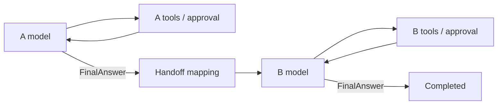

# Stage 23: Durable two-Agent sequence

Status: Implemented and locally verified; independent implementation review PASS.
Execution: [Plan 035](../exec-plans/completed/035-durable-agent-sequence.md).

## Objective

Compose two independently configured Tool-calling Agents in fixed order. Agent A
produces a validated structured result; an application mapper creates Agent B's
initial messages. If B suspends for approval and the process terminates, a fresh
sequence resumes without running A again from that persisted boundary.

This is one capability: durable sequential composition. Streaming, approval and
identity are acceptance dimensions of the same execution path, not separate
products. The user explicitly approved the public API, new independent persistence
descriptors, graph identity and optional feature/dependency edge after design review.

## Assumptions and boundaries

- Exactly two stages, one forward handoff, no back edge or dynamic routing.
- Each stage has its own model, ToolRuntime, AgentConfig and required output
  contract. Application messages/policy remain outside the framework.
- One compiled private Core graph, one ThreadId and one checkpoint lineage.
  Stage identity is logical attribution, not a separately persisted child run.
- Reuse existing node behavior privately; do not wrap an entire nested Agent
  invocation in one parent Node or expose ToolCallingAgent's private graph.
- No independent child stores, scheduler, parallel workers, agent-as-tool,
  shared memory, context summarization, automatic retry, or provider additions.
- Existing Core, Tool, SQLite, Model and Genai production APIs stay unchanged.
  Existing Agent snapshots, codecs, graph identities and methods stay unchanged.
- Rust 2024 / MSRV 1.88; offline tests; no live provider quota or Git publication.

## Current implementation evidence

At `8aece5d51d2d32140e8f1c863aba5826fd93844b`:

- `prebuilt/src/agent.rs` owns ModelNode, ToolNode and private graph construction.
  ToolCallingAgent stores the compiled graph, not an extractable model/tool spec.
- `prebuilt/src/state.rs` holds one transcript and returns typed AgentUpdate;
  Runtime alone applies updates. This is suitable for immutable stage projection.
- `prebuilt/src/approval.rs` approval requests currently lack a stage identity.
- `prebuilt/src/codec.rs` only recognizes existing Agent snapshots/interrupts.
  Reusing its descriptor for a composite snapshot would be a compatibility bug.
- `prebuilt/src/structured_output.rs` binds output configuration to graph identity
  and revalidates completed output. Its post-Core conversion error boundary
  remains relevant to composite Resume/Replay/Fork.
- Core already supplies deterministic routing, checkpoint CAS, interrupts,
  cancellation and paths. A second orchestration runtime is unnecessary.

## Architecture



All nodes operate on one private SequenceState containing two disjoint stage
states plus a phase: First, Second, or Stopped. B has no transcript before the
handoff update commits. Stage nodes borrow `&AgentState` and return a tagged
AgentUpdate; only SequenceState::apply performs mutation. Extract shared private
node helpers without changing existing standalone Agent node names or topology.

Routing is synchronous after commit. A FinalAnswer routes to handoff; A
MaxRounds routes to terminal with no B invocation. B FinalAnswer or MaxRounds
routes to terminal. The sole handoff Node validates A's completed output, calls
the mapper once for that attempt, validates its returned initial messages, and
returns an update containing B's owned messages. No user callback runs in routing.

The maximum executed-node bound is checked arithmetic:
`2 * first.max_rounds + 1 + 2 * second.max_rounds`. Each stage also retains its
own model-round limit. No global lock, State Clone requirement or task per stage.

## Public API

All additions live in experimental Prebuilt under optional `agent-sequence`.
The feature activates existing `structured-output` plus optional workspace
`sha2 = 0.10.9`; no new package versions. Default features remain unchanged.

| Type / method | Contract |
| --- | --- |
| `AgentStageId::new(name)` | Validated 1-64 ASCII alphanumeric, `_` or `-`; stage IDs must differ |
| `AgentStage::new(id, model, tools, config, output)` | Own immutable construction ingredients; require structured capability; no access to existing private graphs |
| `HandoffMapper` | Object-safe `Send + Sync`, synchronous `map(&ValidatedJsonOutput) -> Result<Vec<Message>, HandoffError>` |
| `HandoffError::with_source(source)` | Typed boxed concrete Error + Send + Sync; payload-safe wrapper formatting; source remains reachable |
| `AgentSequence::new(revision, first, second, Arc<dyn HandoffMapper>)` | Validate revision with same bounds as stage ID; compile once; bind identity below |
| `SequenceOutcome` | Read-only first result, optional second result, stopping stage and stop reason; `final_output()` only for B FinalAnswer |
| `SequenceRunOutcome` | Completed outcome or persisted interrupt report, matching existing Agent outcome conventions |
| `SequenceApprovalRequest` | Stage ID plus exact existing AgentApprovalRequest, safe Debug |
| `SequenceApprovalDecision::new(stage, decision)` | Target stage plus existing Approve/Reject; one-attempt resume value |
| `SequenceSnapshot`, `SequenceSnapshotCodec` | Opaque independent snapshot and codec; explicit new descriptors |
| `SequenceError`, `SequenceBuildError` | Typed classifications, stage accessor where applicable, preserved source chains, safe Debug/Display |
| `SequenceStreamEvent`, `SequenceEventSink`, `SequenceEventStream` | Stage-tagged existing Agent events, handoff notification and parent durable/terminal events |

SequenceStage and SequenceRevision are not additional public types: the constructor
revision is an owned string validated at admission, and AgentStageId identifies
a stage. AgentConfig remains Copy.

Mirror existing Agent entrypoint signatures with SequenceSnapshot/Outcome/Error:
`invoke`, `invoke_with_control`, `invoke_with_checkpoint`,
`invoke_with_checkpoint_control`, `stream`, `stream_with_control`,
`stream_with_checkpoint`, `stream_with_checkpoint_control`, `resume`,
`resume_stream`, `replay`, `fork`. Sink methods mirror invoke/resume sink variants.
Replay/Fork reports retain branch/checkpoint metadata, with composite outcomes.
Reuse Core configuration types; no separate checkpoint configuration framework.

Normal invoke is allowed only when neither stage requests Tool approval. Durable
start rejects a policy other than EverySuperstep before model, mapper or Tool
work. Resume and Fork explicitly normalize their Core configs with
`with_checkpoint_policy(EverySuperstep)`, regardless of the supplied policy; this
mandatory behavior is documented on both methods. ResumeConfig has a public
`target()` getter for checkpoint pin checks, but no policy getter. No new Core
API or wrapper config is needed. This makes saved handoff boundaries
part of this capability's contract instead of an optional persistence detail.

Application mapper sketch (the complete offline example is `agent_sequence`):

```rust
// Application code owns prompts, business checks and Rust types.
fn map_task(output: &ValidatedJsonOutput) -> Result<Vec<Message>, HandoffError> {
    let task: Task = output.deserialize().map_err(HandoffError::with_source)?;
    Ok(vec![Message::user(task.instruction)])
}
```

The mapper is synchronous, bounded and free of external side effects by contract;
Rust cannot enforce purity or prevent blocking inside arbitrary application code.
No async mapper, service access or retry callback is provided. The concrete Rust
Task type is application-owned; its version belongs to the explicit revision.

## Messages, events and controls

Invoke messages initialize A only. B receives only the mapper's return value.
Neither A's transcript, system instructions, Tool arguments/results nor approval
history is forwarded automatically. Admission validates the same common message
invariants as the Model facade before B can call its model. Reject empty input,
invalid Tool pairing or assistant pending calls at the handoff boundary. B model
capability admission still occurs through ChatModel before dispatch.

Stage events carry AgentStageId. Forward token/model/tool/approval-proposal
events with their existing provisional semantics. Filter child Completed and
Interrupted: there is only one parent terminal event from the Core result after
snapshot save/output conversion. Event Debug excludes prompt/output payloads.
Round numbers remain per-stage; ToolCallId is scoped with stage ID. Existing
ToolRuntime observer composition is preserved.

A handoff notification emitted inside its Node is provisional. There is no
claim that a received handoff event proves the subsequent checkpoint persisted.
A successful persisted Interrupted/Completed report is the durable boundary.
Per-invocation sinks are transient and restored through Core's existing state
initializer; snapshots never encode callbacks or observers.

RunControl applies to the entire sequence attempt; Node timeout applies to each
model/tool/handoff Node. A synchronous mapper cannot be preempted mid-call;
control is checked before it and before any later node starts. No detached child
future survives stream drop, cancellation or timeout. A pending raw model EOF
must not produce a successful parent completion.

## Durable identity and snapshot

New snapshot descriptor: `group-agent-prebuilt-agent-sequence-state`, version 1,
encoding `json`. New interrupt descriptor:
`group-agent-prebuilt-agent-sequence-approval`, version 1, encoding `json`.
No migration or decoding standalone Agent snapshots as sequence state.

Snapshot contains phase and first/optional-second canonical stage snapshots.
No duplicate typed JSON values or model/tool/mapper objects. Decode/restore
checks phase/transcript/round/stop consistency. Before any restored Node performs model, mapper or Tool work,
revalidate all completed structured stage results against current
contracts; malformed saved A must not drive a handoff or B Tool execution.
Enforce this using shared private invariant guards before each Node performs
model/mapper/Tool work, including Fork, which has no restore initializer. This
may revalidate the bounded prior result at several nodes; tests and performance
review must account for that cost. Completed zero-node paths validate at outcome
conversion. No additional Core restore API is proposed.
Replay is exact and read-only with respect to checkpoint lineage only. Replaying
an unfinished checkpoint can rerun mapper/model/Tool nodes and cause external
effects; it is not a sandbox or an effect-free historical inspection API. Test
this distinction explicitly, including completed replay with zero calls. Fork
retains existing Core branch semantics;
post-Core outcome conversion failure may follow a branch write and must not be
represented as rollback. A Fork node invariant guard can also fail after Core
has created the branch, although before any downstream external effect. Only
pre-execution graph-identity rejection promises no branch creation. Latest-only
Resume remains unchanged.

Graph identity is `group-agent-prebuilt/agent-sequence/1/<digest>`, SHA-256 of
compact UTF-8 JSON with recursively sorted object keys, arrays preserved:

```text
["group-agent-sequence/1", revision,
 [[first_id, first.max_rounds, first.tool_approval, first.output.contract_id],
  [second_id, second.max_rounds, second.tool_approval, second.output.contract_id]]]
```

Golden vectors pin this encoding. Changing order, IDs, limits, approval flags,
output contracts or revision rejects Resume/Replay/Fork before execution or
branch creation. Application must bump revision when mapper logic, prompts,
Tool behavior or other relevant application semantics change. Closures cannot be
hashed reliably; identical revision is a declaration, not proof of identical
code. Model/provider choice and concrete Rust type are not automatically hashed.
The digest does not authenticate a hostile Store.

No child RunId or ThreadId is invented. Diagnostics identify
`(parent ThreadId, branch/checkpoint lineage, current Core RunId, AgentStageId)`;
Core attempt RunId may change on Resume, while stage IDs are stable. Approval
interrupts wrap the active stage's pending calls. Require an explicit saved
checkpoint ID on approval Resume and a decision matching the active stage;
stale checkpoint, wrong stage/type or absent decision fails before Tool work.
A sequence Tool wrapper downcasts SequenceApprovalDecision, checks its stage,
and invokes shared execute/reject helpers; it must not pass the wrapper to the
standalone node expecting AgentApprovalDecision.
Applications must use the durable interrupt report, not ApprovalRequired alone.

## Crash and concurrency semantics

| Last successfully saved boundary | Recovery behavior |
| --- | --- |
| A final answer, handoff not saved | Revalidate A; rerun pure mapper; never rerun A from this head |
| Handoff committed and saved | Use B's saved initial messages; no mapper or A rerun |
| B approval interrupt saved | Require matching decision; A/mapper remain untouched |
| B Tool results saved | Continue from saved results; do not execute that saved batch again |
| Sequence completed | Revalidate completed results; no model, Tool or mapper calls |
| External Tool effect occurred but its checkpoint did not save | Outcome may be unknown; existing side-effect/idempotency policy still applies |

A callback or model response before its checkpoint saves can run again after a
crash. No hidden retry and no exactly-once guarantee. Concurrent attempts inherit
Core CAS: CAS can reject a stale save after external effects; it is not a lease
or an execution mutex. Callers serialize approval attempts or supply external
coordination. No in-process global lock disguises this limitation.

## Acceptance and verification

Public tests must cover complete/stream/sink parity; separate model histories and
Tool registries; typed A-to-B handoff; first/second MaxRounds; mapper error/source,
invalid mapping and no B dispatch; unsupported capability rejection; safe default
formatting; two independent concurrent threads without sink leakage.

Durability tests prove Resume/Fork configured with FinalOnly still persist every
super-step under the documented normalization. They cover approval/rejection in either stage; wrong stage/decision,
stale/missing checkpoint pin and missing resume value; save failures at A-final,
handoff and B-approval; exact Replay and Fork metadata; graph mismatch with no
branch creation/calls; malformed completed A rejected before downstream effects;
completed recovery with no work; dropped stream, cancellation and Node deadlines.

Fresh-process SQLite tests use marker-driven kill/reap and a synced Tool journal
at all rows of the crash matrix where a saved boundary is claimed. Test saved
boundary behavior separately from unsaved external-effect uncertainty. Golden
old Agent snapshot bytes/IDs remain unchanged. No timing-only synchronization.

Expected focused files: Prebuilt `tests/agent_sequence*.rs`,
`test_support/sequence_agent.rs`, `examples/agent_sequence.rs` (required feature).
Private implementation: `src/sequence/{mod,state,nodes,handoff,approval,codec,
identity,error,event,durable}.rs`; shared private node helpers extracted from
agent.rs only as necessary. Follow repository typed errors and rustfmt style.

Implementation commands:

```bash
cargo test --locked --offline -p group-agent-prebuilt --features agent-sequence
cargo run --locked --offline -p group-agent-prebuilt --features agent-sequence --example agent_sequence
cargo test --locked --offline --workspace --all-features
GROUP_VERIFY_OFFLINE=1 ./scripts/verify all
git diff --check
```

Also check isolated Prebuilt consumers with defaults, structured-output alone and
agent-sequence on stable and Rust 1.88; inspect dependency edges. Compile existing
benchmarks and review allocations/clone costs; claim no performance improvement
without measurement. Every production behavior change needs a public-boundary
test. Independent read-only review is required at shared-helper and final stages.

Always preserve current single-Agent semantics and document failure boundaries.
The user approved the listed public additions, independent descriptors, graph
identity and feature/dependency edges. Stop for any additional
Core API/migration, hidden retry, incompatible format or high-risk dependency.
Never log messages, arguments, outputs, approval payloads or panic contents by
default. Source-chain inspection remains an explicit application responsibility.
