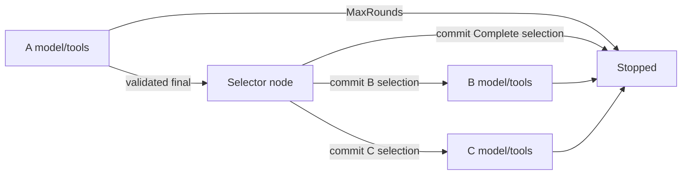

# Stage 24: Durable conditional Agent branching

Status: Implemented and locally verified; independent implementation review PASS.
Accepted by the user on 2026-09-28.
The user authorized this reviewed contract on 2026-09-28. [Plan 036](../exec-plans/completed/036-durable-agent-branching.md)
owns progress and actual verification evidence.

## Outcome and scope

One validated result from A selects B, C, or direct completion. B and C are
configured at construction, have isolated conversations and output contracts,
and never run together. A saved selection is authoritative on recovery.
Unselected Agents make zero model and Tool calls.

Use one private Core graph, ThreadId and checkpoint lineage. Reuse immutable
stage projection and existing ModelNode/ToolNode operations. No nested Agent
invocation, child store, additional scheduler, dynamic target, feedback loop,
parallel join, retry, lease, product policy or release work.

## Consumer evidence and reuse decision

The standalone [consumer](../exec-plans/evidence/036-consumer/src/main.rs)
constructs stages solely through public APIs, deserializes A into an
application Task, maps B messages, consumes checkpointed streaming until B's
saved approval, drops the original sequence, and reconstructs a new sequence
and counters for approval Resume streaming. It imports no test support.

Observed on stable: A and mapper each ran once before suspension, B ran once,
and no Tool ran. After reconstruction: A=0, mapper=0, B=1, Tool=1; all resumed
stage events belong to B, and exactly one parent Completed carries typed output.
This is fresh-object recovery using InMemoryCheckpointer, not process/SQLite
recovery. Rust 1.88 and review evidence are recorded in the Plan.

Construction requires a model, ToolRuntime, AgentConfig and StructuredOutput
per stage. That repetition represents real isolation; no builder abstraction
is justified yet. Approval requires the saved checkpoint and stage, and resumed
stream events attach correctly to the new invocation. Keep those conventions.
The existing example imports repository test support, so it does not by itself
show all consumer construction work; retain the independent fixture as evidence.

AgentStage and AgentStageId currently live in the private sequence module and
return SequenceBuildError from constructors. Preserve their public signatures.
Use `agent-branch = ["agent-sequence"]`: it transitively enables existing
structured-output and sha2, with no new package dependency or default feature.
This intentionally exposes Sequence alongside Branch. Moving shared types or
introducing a generic workflow layer costs more compatibility risk than it
currently saves. Branch constructors return their own typed error.

## Public contract

All additions are experimental Prebuilt exports under `agent-branch`.

| Surface | Contract |
| --- | --- |
| `AgentBranch::new(revision, first, b, c, Arc<dyn BranchSelector>)` | Owned AgentStage values; all three IDs differ; revision uses existing 1-64 ASCII identifier admission |
| `BranchSelector::select(&ValidatedJsonOutput) -> Result<BranchSelection, BranchSelectionError>` | Synchronous, bounded, side-effect-free application callback; blanket closure implementation |
| `BranchSelection::{B(Vec<Message>), C(Vec<Message>), Complete}` | Closed target set; no string node lookup; Complete carries no synthetic output |
| `BranchSelectionError::with_source(source)` | Payload-safe wrapper retaining concrete application error source |
| `BranchTarget::{B, C, Complete}` | Payload-free selection tag; construction position defines B/C, stage ID supplies attribution |
| `BranchOutcome` | `first()`, `selected() -> Option<BranchTarget>`, `downstream() -> Option<&AgentOutcome>`, `stopping_stage()`, `stop_reason()`, `final_output()`, `final_message()` |
| `BranchSnapshot`, `BranchSnapshotCodec` | Opaque independent version-one snapshot and codec |
| `BranchRunOutcome`, `BranchInterrupted`, `BranchReplayReport`, `BranchForkReport` | Same shape and lineage metadata conventions as Sequence equivalents |
| `BranchApprovalRequest`, `BranchApprovalDecision::new(stage, decision)` | Distinct branch payload and resume type; reuse AgentApprovalRequest/Decision internally |
| `BranchStreamEvent`, `BranchEventSink`, `BranchEventStream` | Stage-attributed Agent events, Selection proposal, parent Completed/Interrupted |
| `BranchError`, `BranchBuildError`, `BranchErrorKind` | Typed error and build alias; kind and optional stage accessors; concrete source chain |

The selected tag is None only when A exhausts its rounds. Complete returns A's
validated output. B/C FinalAnswer returns that stage's validated output. Any
MaxRounds returns no final output/message; stopping_stage identifies A/B/C.
There is no framework-owned Rust union for unrelated B/C application types:
match selected(), then deserialize its ValidatedJsonOutput into the appropriate
Rust type. A must have FinalAnswer before the selector runs.

Mirror Sequence's invoke/control, stream/control, checkpoint/control and sink
variants, resume/resume_stream/resume_with_stream_sink, replay and fork. Use
existing Core configurations specialized to BranchSnapshot; add no new config
wrapper, child invocation API, streaming Replay or streaming Fork. Branch
approval wrappers are distinct because their encoded descriptor and accepted
resume type are distinct; Agent-level approval semantics stay shared.

Non-durable entrypoints reject construction with approval enabled in any stage
before work, even if that stage would not be selected. Durable start requires
EverySuperstep; Resume and Fork normalize to EverySuperstep. Default Core
RunConfig gets the derived bound; explicit controls remain caller-owned.

## State and transitions

Private state holds A, a selection tag (initially None), at most one downstream
AgentState, and a phase: First, Selected, or Stopped. A FinalAnswer remains in
First until the selector node commits; A MaxRounds commits Stopped directly.
Selection updates atomically set B/C plus admitted initial messages and Selected,
or Complete plus Stopped. A downstream stop commits Stopped. No unselected
transcript, repeated initial-message copy, decoded JSON or callback is persisted.



Routers read committed state synchronously against fixed target whitelists;
they never call the selector. After selection Update, EverySuperstep saves the
selection/messages before starting B/C. A provisional Selection event is not
evidence of that save. No extra post-selection node is needed for Complete.

Checked execution bound: `2*A.max_rounds + 1 + 2*max(B.max_rounds,C.max_rounds)`.
Reject overflow at construction. Core max_steps is additional attempt budget;
persisted per-stage model_rounds enforce the lifetime stage caps separately.

## New identity and persistence contract

New descriptors (name, version, encoding):

- `group-agent-prebuilt-agent-branch-state`, 1, `json`.
- `group-agent-prebuilt-agent-branch-approval`, 1, `json`.

Snapshot JSON fields: `phase`, `first`, `selection`, `downstream`. Phase encodes
`First`, `Selected`, `Stopped`; selection is null or `B`, `C`, `Complete`.
first and optional downstream use existing canonical AgentSnapshot encoding.
Encode and decode enforce structural invariants; graph-aware guards enforce
current output contracts and configured limits. Never decode an old Agent or
Sequence descriptor as a Branch format, migrate SQLite, or change old goldens.

| Phase | Selection and downstream invariants |
| --- | --- |
| First | selection null; downstream absent; A running or FinalAnswer, never MaxRounds |
| Selected | B/C; A FinalAnswer; exactly the selected downstream exists and is running |
| Stopped, no selection | A MaxRounds; downstream absent |
| Stopped, Complete | A FinalAnswer; downstream absent |
| Stopped, B/C | A FinalAnswer; selected downstream stopped with FinalAnswer or MaxRounds |

Graph version is `group-agent-prebuilt/agent-branch/1/<sha256>` of compact UTF-8
JSON (recursive sorted object keys, arrays preserved):

```text
["group-agent-branch/1", revision,
 [[a_id, a.max_rounds, a.tool_approval, a.output.contract_id],
  [b_id, b.max_rounds, b.tool_approval, b.output.contract_id],
  [c_id, c.max_rounds, c.tool_approval, c.output.contract_id]]]
```

Pin bytes/digest with golden vectors. Reordering/changing any stage, including
the unselected one, rejects restore through graph identity. Revision must change
when selector, prompt, Tool or other application semantics change. Model/provider
choice and Rust output type are not automatically hashed. This is compatibility
identity, not authentication or proof of callback purity.

Before every model, Tool or selector call, check phase, actual node, selection,
pending calls, transcript pairing, usage alignment and configured round caps;
revalidate completed A output and any completed downstream output. Model nodes
reject pending calls/exhausted caps; Tool nodes require pending calls and a
committed model round. Selector accepts only First/A FinalAnswer/no downstream.
A wrong B/C node fails before that node performs effects. Core validates
structural frontier only; it cannot infer these semantic constraints. Empty-frontier completed paths
validate stopped state and output at outcome conversion. Never repair corrupt
selection by rerunning the callback. Store tamper authentication is out of scope.

The no-effects corruption guarantee is local to each node and to snapshot
restore, not whole-frontier preflight. Branch writes only singleton frontiers,
but Core can accept a forged multi-node frontier containing a valid selected
node and an invalid other node. It polls them concurrently: the valid selected
node may perform work before the other guard fails. Unselected nodes still
perform no model/Tool/selector work. Test this mixed-frontier case explicitly;
do not claim all effects are excluded. Existing Core configs do not expose
checkpointer replacement, and restore initializers do not receive frontier
metadata, so a transparent Prebuilt wrapper cannot provide stronger preflight.
Adding such a Core public hook would require a separate design/authorization;
it is excluded from this capability. Storage trust and integrity remain caller
responsibilities; an identity digest does not secure hostile checkpoint data.

Resume is latest-only. Replay is exact and writes no lineage, but can repeat
unsaved model/Tool/selector work. Fork alone writes a historical branch. Identity
mismatch precedes branch creation; a semantic node guard or outcome validation
failure can follow Fork branch creation. Error never implies general rollback.

## Approval, events, controls and failure matrix

Only A or the selected downstream can interrupt. BranchApprovalRequest wraps its
stage ID and exact pending calls. Approval Resume requires an explicit latest
checkpoint pin and a matching BranchApprovalDecision; reject missing, stale,
wrong-type or wrong-stage decisions before Tool work. Reject produces existing
business-error ToolMessages, then continues that stage. CAS is not execution
locking; applications coordinate competing approval attempts.

Stage events retain local rounds and stage-scoped ToolCallId. Selection carries
A's ID and BranchTarget without messages/output and is provisional. Filter child
terminal events; emit one parent terminal after Core save and outcome validation.
Resume attaches fresh transient sinks through the existing initializer, without
persisting observers or replaying historical tokens. Preserve Tool observers.

| Failure or boundary | Required classification and effects |
| --- | --- |
| Invalid construction/revision/duplicate ID/overflow/policy | Configuration, no model/Tool/selector calls |
| Selector returns error | Graph error chain retains BranchSelectionError and concrete source, attributed to A; no selection commit or downstream work |
| Selector panics with unwind | Catch only the synchronous selector call; SelectorPanicked kind, attributed to A, no payload retained or formatted; no update/downstream work |
| Invalid selected messages | InvalidState reachable in Graph source chain; selection not committed, no downstream work |
| Corrupt saved state/frontier/cap/output | Typed codec/restore/Graph/Output failure with concrete sources and stage where known; a failing node performs no external work, subject to the mixed-frontier limit above |
| A MaxRounds | Normal outcome, selected None, selector/B/C zero calls |
| A-final saved, selection unsaved | Resume revalidates A and may rerun selector; A not rerun from this head |
| Selection save fails | Graph persistence error with concrete source; no downstream work or successful durable terminal event |
| B/C selection saved | Fresh recovery uses saved target/messages; A and selector zero calls |
| Complete selection saved | Completed recovery validates A; zero model/Tool/selector calls |
| Approval or Tool results saved | Recover active stage only; saved Tool batch does not repeat |
| External effect before failed/missing save | May repeat; no hidden retry, rollback or exactly-once claim |
| Cancellation, timeout or stream drop | Existing typed Core control boundary; drop owned futures; no detached execution |

Error kinds are Configuration, InvalidState, Graph, Output and SelectorPanicked.
Graph remains the wrapper for node/store/control failures; panic extraction uses
a private marker in the source chain. Default Debug/Display for errors, selection,
events and snapshots exclude messages, arguments, results and panic payloads.
Panic conversion covers unwind builds only; abort cannot be recovered. The
process panic hook runs before catch_unwind and remains application-controlled;
no global hook changes or claim of hook redaction. Other arbitrary callbacks
retain existing panic semantics. A synchronous selector cannot be preempted
mid-call; cancellation is enforced before it and before downstream execution.

## Verification and performance requirements

Public tests cover B/C/Complete with different output schemas, independent
registries/transcripts, zero calls in unselected stages, A/downstream exhaustion,
selector error/panic and source reachability, invalid messages and safe formatting.
Run invoke/stream/sink parity, approval approve/reject and negative decisions,
concurrent independent threads, cancellation/deadline/drop and EOF failure.

Store corruption tests exercise phase/selection/cap inconsistencies and wrong
single-node frontiers on Resume/Replay/Fork, including completed zero-node paths,
saved-output revalidation and branch-write limits. A separate forged mixed-frontier
test verifies unselected nodes perform zero work while allowing work from the
valid selected node before failure; it must not assert whole-frontier atomicity. Save-failure tests cover A final, selection
(including Complete) and approval; events must not falsely certify persistence.
Marker-driven SQLite child kill/reap tests cover before/after selection save,
both targets, direct completion, approval and saved Tool results with exact
cross-process counters/journal. No timing-only synchronization.

Default, structured-output, agent-sequence and agent-branch independent consumers
must compile on stable and Rust 1.88. Pin existing Agent/Sequence bytes and graph
goldens. Unified all gates plus stable workspace all-feature tests are required
for implementation; no live provider quota.

Expected cost: three immutable stage configurations but at most two transcripts;
one selector node and one mandatory selection save on selected paths; repeated
bounded schema validation before restored effects. No task per stage, global
run lock or clone of full runtime State. Streaming retains existing unbounded
event-channel behavior; bounded memory/backpressure is not newly promised.
Benchmark compilation is not timing evidence. Record transcript sizes and
allocation/validation/save costs in implementation review; measured performance
claims require a separately specified reproducible benchmark.


## Runnable consumer and test locations

The self-contained offline example defines its own model, Tool, selector and
output types without importing test support:

```bash
cargo run --locked --offline -p group-agent-prebuilt --features agent-branch --example agent_branch
```

The [standalone Branch consumer](../exec-plans/evidence/036-branch-consumer/Cargo.toml)
compiles that same example outside the workspace. Public tests are
`crates/group-agent-prebuilt/tests/agent_branch*.rs`, including real-process
SQLite recovery and forged-frontier characterization. The earlier Sequence
consumer above remains design-input evidence, not Branch verification.
